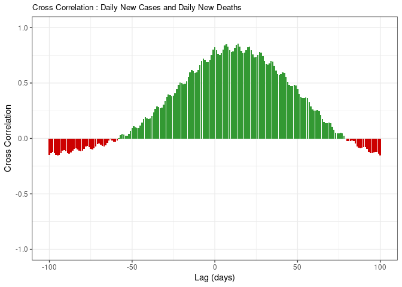
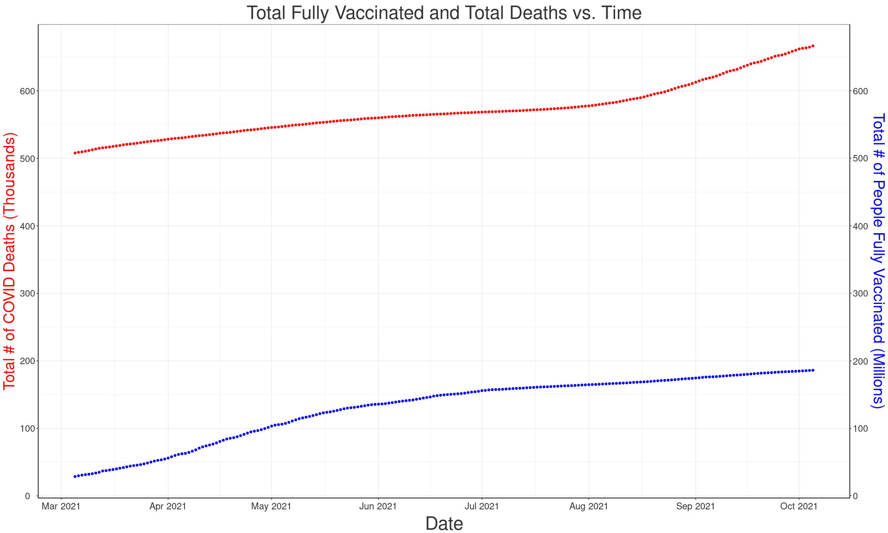
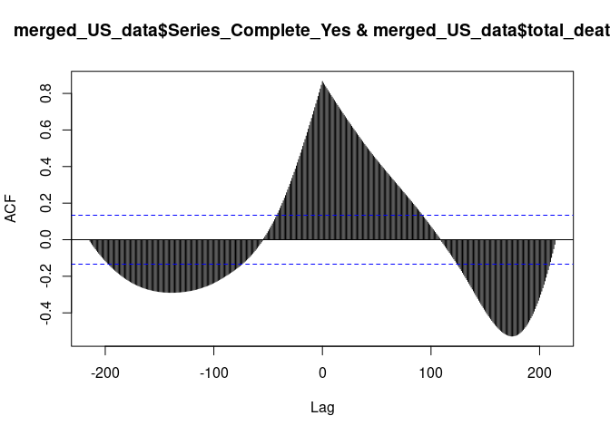

Scratchwork
================

``` r
library(tidyverse)
library(broom)
library(lubridate)
library(devtools)
library(dsbox)
library(ggridges)
library(tidymodels)
library(openintro)
```

``` r
US_deaths_cases <- 
  read_csv("/cloud/project/data/United_States_COVID-19_Cases_and_Deaths_by_State_over_Time.csv")
```

    ## Rows: 37380 Columns: 15

    ## ── Column specification ────────────────────────────────────────────────────────
    ## Delimiter: ","
    ## chr  (5): submission_date, state, created_at, consent_cases, consent_deaths
    ## dbl (10): tot_cases, conf_cases, prob_cases, new_case, pnew_case, tot_death,...

    ## 
    ## ℹ Use `spec()` to retrieve the full column specification for this data.
    ## ℹ Specify the column types or set `show_col_types = FALSE` to quiet this message.

``` r
glimpse(US_deaths_cases)
```

    ## Rows: 37,380
    ## Columns: 15
    ## $ submission_date <chr> "02/12/2021", "03/01/2021", "08/22/2020", "08/12/2020"…
    ## $ state           <chr> "UT", "CO", "AR", "AS", "AS", "MA", "GA", "NYC", "AS",…
    ## $ tot_cases       <dbl> 359641, 438745, 56199, 0, 0, 704796, 1187107, 948436, …
    ## $ conf_cases      <dbl> 359641, 411869, NA, NA, NA, 659246, 937515, 782257, NA…
    ## $ prob_cases      <dbl> 0, 26876, NA, NA, NA, 45550, 249592, 166179, NA, NA, 4…
    ## $ new_case        <dbl> 1060, 677, 547, 0, 0, 451, 3829, 394, 0, 8835, 2766, 3…
    ## $ pnew_case       <dbl> 0, 60, 0, 0, NA, 46, 1144, 95, 0, 2003, 317, 29, 400, …
    ## $ tot_death       <dbl> 1785, 5952, 674, 0, 0, 17818, 21690, 33203, 0, 19190, …
    ## $ conf_death      <dbl> 1729, 5218, NA, NA, NA, 17458, 18725, 28130, NA, NA, 3…
    ## $ prob_death      <dbl> 56, 734, NA, NA, NA, 360, 2965, 5073, NA, NA, 0, 307, …
    ## $ new_death       <dbl> 11, 1, 11, 0, 0, 5, 7, 6, 0, 66, 3, 15, 10, 69, 0, 5, …
    ## $ pnew_death      <dbl> 2, 0, 0, 0, NA, 0, 0, 0, 0, 2, 0, 1, 2, 0, 0, 0, 0, 0,…
    ## $ created_at      <chr> "02/13/2021 02:50:08 PM", "03/01/2021 12:00:00 AM", "0…
    ## $ consent_cases   <chr> "Agree", "Agree", "Not agree", NA, NA, "Agree", "Agree…
    ## $ consent_deaths  <chr> "Agree", "Agree", "Not agree", NA, NA, "Agree", "Agree…

``` r
US_vaccinations <- 
  read_csv("/cloud/project/data/COVID-19_Vaccinations_in_the_United_States_Jurisdiction.csv")
```

    ## Rows: 19208 Columns: 81

    ## ── Column specification ────────────────────────────────────────────────────────
    ## Delimiter: ","
    ## chr  (2): Date, Location
    ## dbl (79): MMWR_week, Distributed, Distributed_Janssen, Distributed_Moderna, ...

    ## 
    ## ℹ Use `spec()` to retrieve the full column specification for this data.
    ## ℹ Specify the column types or set `show_col_types = FALSE` to quiet this message.

``` r
glimpse(US_vaccinations)
```

    ## Rows: 19,208
    ## Columns: 81
    ## $ Date                                   <chr> "10/05/2021", "10/05/2021", "10…
    ## $ MMWR_week                              <dbl> 40, 40, 40, 40, 40, 40, 40, 40,…
    ## $ Location                               <chr> "VA", "NV", "RP", "NE", "MI", "…
    ## $ Distributed                            <dbl> 12869745, 4045120, 33090, 25822…
    ## $ Distributed_Janssen                    <dbl> 573200, 199900, 3800, 116400, 6…
    ## $ Distributed_Moderna                    <dbl> 4833340, 1475340, 22900, 979980…
    ## $ Distributed_Pfizer                     <dbl> 7463205, 2369880, 6390, 1485870…
    ## $ Distributed_Unk_Manuf                  <dbl> 0, 0, 0, 0, 0, 0, 0, 0, 0, 0, 0…
    ## $ Dist_Per_100K                          <dbl> 150779, 131328, 184788, 133490,…
    ## $ Distributed_Per_100k_12Plus            <dbl> 176130, 154288, 216388, 159654,…
    ## $ Distributed_Per_100k_18Plus            <dbl> 192815, 169428, 237255, 177068,…
    ## $ Distributed_Per_100k_65Plus            <dbl> 947067, 815594, 1090640, 826431…
    ## $ Administered                           <dbl> 11024264, 3443155, 31240, 22012…
    ## $ Administered_12Plus                    <dbl> 10992921, 3443100, 31240, 22009…
    ## $ Administered_18Plus                    <dbl> 10178448, 3225317, 28652, 20476…
    ## $ Administered_65Plus                    <dbl> 2517946, 850914, 3551, 600142, …
    ## $ Administered_Janssen                   <dbl> 399119, 151785, 2333, 79234, 37…
    ## $ Administered_Moderna                   <dbl> 3963920, 1219801, 24444, 817158…
    ## $ Administered_Pfizer                    <dbl> 6655345, 2071438, 4463, 1300158…
    ## $ Administered_Unk_Manuf                 <dbl> 5880, 131, 0, 4746, 1616, 1270,…
    ## $ Administered_Fed_LTC                   <dbl> 217074, 74066, 0, 60654, 295799…
    ## $ Administered_Fed_LTC_Residents         <dbl> 109722, 16660, 0, 27041, 141181…
    ## $ Administered_Fed_LTC_Staff             <dbl> 80551, 14302, 0, 23762, 86738, …
    ## $ Administered_Fed_LTC_Unk               <dbl> 26801, 43104, 0, 9851, 67880, 1…
    ## $ Administered_Fed_LTC_Dose1             <dbl> 121472, 50270, 0, 37443, 182161…
    ## $ Administered_Fed_LTC_Dose1_Residents   <dbl> 58921, 9149, 0, 16713, 81899, 2…
    ## $ Administered_Fed_LTC_Dose1_Staff       <dbl> 44628, 7977, 0, 15423, 51531, 1…
    ## $ Administered_Fed_LTC_Dose1_Unk         <dbl> 17923, 33144, 0, 5307, 48731, 9…
    ## $ Admin_Per_100K                         <dbl> 129158, 111785, 174457, 113797,…
    ## $ Admin_Per_100k_12Plus                  <dbl> 150444, 131326, 204290, 136077,…
    ## $ Admin_Per_100k_18Plus                  <dbl> 152494, 135091, 205435, 140410,…
    ## $ Admin_Per_100k_65Plus                  <dbl> 185292, 171565, 117040, 192071,…
    ## $ Recip_Administered                     <dbl> 11015106, 3407219, 31501, 22079…
    ## $ Administered_Dose1_Recip               <dbl> 5877501, 1886012, 17827, 115491…
    ## $ Administered_Dose1_Pop_Pct             <dbl> 68.9, 61.2, 99.6, 59.7, 57.4, 6…
    ## $ Administered_Dose1_Recip_12Plus        <dbl> 5859164, 1885912, 17827, 115463…
    ## $ Administered_Dose1_Recip_12PlusPop_Pct <dbl> 80.2, 71.9, 99.9, 71.4, 66.7, 7…
    ## $ Administered_Dose1_Recip_18Plus        <dbl> 5430306, 1763229, 16486, 107349…
    ## $ Administered_Dose1_Recip_18PlusPop_Pct <dbl> 81.4, 73.9, 99.9, 73.6, 68.9, 7…
    ## $ Administered_Dose1_Recip_65Plus        <dbl> 1285517, 437932, 1785, 287680, …
    ## $ Administered_Dose1_Recip_65PlusPop_Pct <dbl> 94.6, 88.3, 58.8, 92.1, 89.0, 9…
    ## $ Series_Complete_Yes                    <dbl> 5209839, 1575904, 15556, 106388…
    ## $ Series_Complete_Pop_Pct                <dbl> 61.0, 51.2, 86.9, 55.0, 52.7, 5…
    ## $ Series_Complete_12Plus                 <dbl> 5197778, 1575865, 15556, 106379…
    ## $ Series_Complete_12PlusPop_Pct          <dbl> 71.1, 60.1, 99.9, 65.8, 61.2, 6…
    ## $ Series_Complete_18Plus                 <dbl> 4823813, 1484340, 14304, 992233…
    ## $ Series_Complete_18PlusPop_Pct          <dbl> 72.3, 62.2, 99.9, 68.0, 63.3, 6…
    ## $ Series_Complete_65Plus                 <dbl> 1167111, 385863, 1705, 275394, …
    ## $ Series_Complete_65PlusPop_Pct          <dbl> 85.9, 77.8, 56.2, 88.1, 84.1, 8…
    ## $ Series_Complete_Janssen                <dbl> 390589, 149312, 2338, 79114, 37…
    ## $ Series_Complete_Moderna                <dbl> 1826509, 552554, 11582, 385208,…
    ## $ Series_Complete_Pfizer                 <dbl> 2990444, 874003, 1636, 598304, …
    ## $ Series_Complete_Unk_Manuf              <dbl> 2297, 35, 0, 1260, 868, 446, 3,…
    ## $ Series_Complete_Janssen_12Plus         <dbl> 390495, 149308, 2338, 79096, 37…
    ## $ Series_Complete_Moderna_12Plus         <dbl> 1826340, 552550, 11582, 385188,…
    ## $ Series_Complete_Pfizer_12Plus          <dbl> 2978651, 873972, 1636, 598257, …
    ## $ Series_Complete_Unk_Manuf_12Plus       <dbl> 2292, 35, 0, 1258, 867, 446, 3,…
    ## $ Series_Complete_Janssen_18Plus         <dbl> 389060, 149270, 2338, 79040, 37…
    ## $ Series_Complete_Moderna_18Plus         <dbl> 1821019, 552455, 11582, 385060,…
    ## $ Series_Complete_Pfizer_18Plus          <dbl> 2611548, 782581, 384, 526920, 2…
    ## $ Series_Complete_Unk_Manuf_18Plus       <dbl> 2186, 34, 0, 1213, 810, 398, 3,…
    ## $ Series_Complete_Janssen_65Plus         <dbl> 67735, 23902, 227, 6449, 66933,…
    ## $ Series_Complete_Moderna_65Plus         <dbl> 549368, 180305, 1462, 134092, 7…
    ## $ Series_Complete_Pfizer_65Plus          <dbl> 549284, 181636, 16, 134058, 675…
    ## $ Series_Complete_Unk_Manuf_65Plus       <dbl> 724, 20, 0, 795, 509, 207, 3, 1…
    ## $ Series_Complete_FedLTC                 <dbl> 88584, 23917, 0, 23177, 113757,…
    ## $ Series_Complete_FedLTC_Residents       <dbl> 45746, 7416, 0, 10273, 58777, 2…
    ## $ Series_Complete_FedLTC_Staff           <dbl> 32916, 6273, 0, 8304, 34714, 11…
    ## $ Series_Complete_FedLTC_Unknown         <dbl> 9922, 10228, 0, 4600, 20266, 68…
    ## $ Additional_Doses                       <dbl> 0, 0, 0, 0, 0, 0, 0, 0, 0, 0, 0…
    ## $ Additional_Doses_Vax_Pct               <dbl> 0.0, 0.0, 0.0, 0.0, 0.0, 0.0, 0…
    ## $ Additional_Doses_18Plus                <dbl> 0, 0, 0, 0, 0, 0, 0, 0, 0, 0, 0…
    ## $ Additional_Doses_18Plus_Vax_Pct        <dbl> 0.0, 0.0, 0.0, 0.0, 0.0, 0.0, 0…
    ## $ Additional_Doses_50Plus                <dbl> 0, 0, 0, 0, 0, 0, 0, 0, 0, 0, 0…
    ## $ Additional_Doses_50Plus_Vax_Pct        <dbl> 0.0, 0.0, 0.0, 0.0, 0.0, 0.0, 0…
    ## $ Additional_Doses_65Plus                <dbl> 0, 0, 0, 0, 0, 0, 0, 0, 0, 0, 0…
    ## $ Additional_Doses_65Plus_Vax_Pct        <dbl> 0.0, 0.0, 0.0, 0.0, 0.0, 0.0, 0…
    ## $ Additional_Doses_Moderna               <dbl> 0, 0, 0, 0, 0, 0, 0, 0, 0, 0, 0…
    ## $ Additional_Doses_Pfizer                <dbl> 0, 0, 0, 0, 0, 0, 0, 0, 0, 0, 0…
    ## $ Additional_Doses_Janssen               <dbl> 0, 0, 0, 0, 0, 0, 0, 0, 0, 0, 0…
    ## $ Additional_Doses_Unk_Manuf             <dbl> 0, 0, 0, 0, 0, 0, 0, 0, 0, 0, 0…

First we filter the data so it only includes the most up-to-date
vaccination numbers as of 10/05/2021:

``` r
October_vaccinations <- filter(US_vaccinations, Date == "10/05/2021")
```

Next, we take the top 20 locations and create a bar plot to see which
vaccines are in each respective location:

``` r
October_vaccinations %>% 
  select(Location, Series_Complete_Yes, Series_Complete_Janssen,
         Series_Complete_Moderna, Series_Complete_Pfizer, 
         Series_Complete_Unk_Manuf) %>%
  filter(Location != "US") %>%
  group_by(Location) %>%
  arrange(desc(Series_Complete_Yes)) %>%
  head(20) %>%
  pivot_longer(cols = -Location, names_to = "Series_Type") %>%
  filter(Series_Type == "Series_Complete_Janssen" | 
           Series_Type == "Series_Complete_Moderna" |
           Series_Type == "Series_Complete_Pfizer" | 
           Series_Type == "Series_Complete_Unk_Manuf") %>%
  ggplot(aes(x = reorder(Location, value), 
             y = value/ 10^6, 
             fill = Series_Type)) +
  geom_bar(stat = "identity") + 
  labs(title = "US Vaccinations Breakdown",
       x = "Location",
       y = "People (in millions)",
       fill = "Type of Vaccine") +
  coord_flip() + 
  theme_bw() +
  scale_color_viridis_d() +
  scale_y_continuous(breaks = scales::pretty_breaks(n = 20))
```

<!-- -->

It looks like the Pfizer vaccine is the most popular across the board.
If we want a better visualization to compare states, we could filter out
the `US` location from this chart.

``` r
October_vaccinations %>% 
  select(Location, Series_Complete_Yes, Series_Complete_Janssen,
         Series_Complete_Moderna, Series_Complete_Pfizer, 
         Series_Complete_Unk_Manuf) %>%
  filter(!(Location %in% c("VI", "VA2", "DD2", 
                       "PR", "IH2", "BP2", 
                       "GU", "FM", "MP", 
                       "AS", "MH", "RP", 
                       "LTC"))) %>%
  group_by(Location) %>%
  arrange(desc(Series_Complete_Yes)) %>%
  pivot_longer(cols = -Location, names_to = "Series_Type") %>%
  filter(Series_Type == "Series_Complete_Janssen" | 
           Series_Type == "Series_Complete_Moderna" |
           Series_Type == "Series_Complete_Pfizer" | 
           Series_Type == "Series_Complete_Unk_Manuf") %>%
  ggplot(aes(x = reorder(Location, value), 
             y = value/ 10^6, 
             fill = Series_Type)) +
  geom_bar(stat = "identity", position = "fill") + 
  labs(title = "US Vaccinations Breakdown",
       x = "Location",
       y = "Fraction of Population",
       fill = "Type of Vaccine") +
  coord_flip() + 
  theme_bw() +
  scale_color_viridis_d() +
  scale_y_continuous(breaks = scales::pretty_breaks(n = 10)) 
```

<!-- -->

Vaccination breakdown for all 50 states and DC.

``` r
new_US_deaths_cases <- US_deaths_cases %>%
  filter(!(state %in% c("NYC", "PR", "GU",
                           "VI", "MP", "RMI",
                           "AS", "PW", "FSM"))) %>%
  group_by(submission_date) %>%
  summarise(total_new_cases = sum(new_case),
            total_new_deaths = sum(new_death),
            total_cases = sum(tot_cases),
            total_deaths = sum(tot_death)) 

new_US_deaths_cases$submission_date = as.Date(new_US_deaths_cases$submission_date,
                                              format="%m/%d/%Y")

new_US_deaths_cases <- new_US_deaths_cases %>%
  arrange(desc(submission_date))

new_US_deaths_cases
```

    ## # A tibble: 623 × 5
    ##    submission_date total_new_cases total_new_deaths total_cases total_deaths
    ##    <date>                    <dbl>            <dbl>       <dbl>        <dbl>
    ##  1 2021-10-05                97795             1931    42579909       666441
    ##  2 2021-10-04                70023              929    42481876       664510
    ##  3 2021-10-03                70437              646    42411824       663512
    ##  4 2021-10-02                80172              968    42341180       662842
    ##  5 2021-10-01               115710             1827    42260515       661874
    ##  6 2021-09-30               114501             1624    42143377       660005
    ##  7 2021-09-29               115726             1949    42027449       658347
    ##  8 2021-09-28               109928             1741    41910369       656348
    ##  9 2021-09-27                86227             1152    41799372       654585
    ## 10 2021-09-26                80308              812    41712532       652986
    ## # … with 613 more rows

``` r
new_US_deaths_cases %>% 
  slice_max(total_new_cases, n = 5) 
```

    ## # A tibble: 5 × 5
    ##   submission_date total_new_cases total_new_deaths total_cases total_deaths
    ##   <date>                    <dbl>            <dbl>       <dbl>        <dbl>
    ## 1 2021-01-06               286542             4040    21284925       363853
    ## 2 2021-01-08               285602             3882    21851544       371683
    ## 3 2021-01-07               281017             3948    21565942       367801
    ## 4 2020-12-31               271925             3608    19977485       345026
    ## 5 2020-12-30               268746             3879    19705560       341418

``` r
max_cases_row <- new_US_deaths_cases %>% 
  slice_max(total_new_cases, n = 1) 

max_cases_date <- max_cases_row$submission_date

max_cases_date
```

    ## [1] "2021-01-06"

``` r
new_US_deaths_cases %>%
  slice_max(total_new_deaths, n = 5)
```

    ## # A tibble: 5 × 5
    ##   submission_date total_new_cases total_new_deaths total_cases total_deaths
    ##   <date>                    <dbl>            <dbl>       <dbl>        <dbl>
    ## 1 2021-01-13               232342             4095    22914389       388855
    ## 2 2021-01-12               205260             4044    22682047       384760
    ## 3 2021-01-06               286542             4040    21284925       363853
    ## 4 2021-01-07               281017             3948    21565942       367801
    ## 5 2021-01-20               186943             3947    24179795       412045

``` r
max_deaths_row <- new_US_deaths_cases %>% 
  slice_max(total_new_deaths, n = 1) 

max_deaths_date <- max_deaths_row$submission_date

max_deaths_date
```

    ## [1] "2021-01-13"

``` r
as.integer(max_deaths_date) - as.integer(max_cases_date)
```

    ## [1] 7

``` r
x <- as.ts(c(11,7,8,12,14))
y <- as.ts(c(7,10,6,7,10))
x
```

    ## Time Series:
    ## Start = 1 
    ## End = 5 
    ## Frequency = 1 
    ## [1] 11  7  8 12 14

``` r
ccf_values1 = ccf(new_US_deaths_cases$total_new_cases, new_US_deaths_cases$total_new_deaths, lag.max = 100)
```

<!-- -->

``` r
ccf_values1
```

    ## 
    ## Autocorrelations of series 'X', by lag
    ## 
    ##   -100    -99    -98    -97    -96    -95    -94    -93    -92    -91    -90 
    ## -0.149 -0.129 -0.122 -0.134 -0.149 -0.154 -0.146 -0.130 -0.112 -0.105 -0.116 
    ##    -89    -88    -87    -86    -85    -84    -83    -82    -81    -80    -79 
    ## -0.132 -0.137 -0.127 -0.111 -0.093 -0.086 -0.097 -0.112 -0.116 -0.108 -0.092 
    ##    -78    -77    -76    -75    -74    -73    -72    -71    -70    -69    -68 
    ## -0.074 -0.067 -0.079 -0.095 -0.099 -0.088 -0.071 -0.051 -0.043 -0.055 -0.069 
    ##    -67    -66    -65    -64    -63    -62    -61    -60    -59    -58    -57 
    ## -0.072 -0.061 -0.040 -0.019 -0.008 -0.018 -0.031 -0.032 -0.018  0.005  0.030 
    ##    -56    -55    -54    -53    -52    -51    -50    -49    -48    -47    -46 
    ##  0.042  0.035  0.024  0.026  0.042  0.067  0.094  0.109  0.102  0.092  0.096 
    ##    -45    -44    -43    -42    -41    -40    -39    -38    -37    -36    -35 
    ##  0.114  0.143  0.173  0.189  0.183  0.174  0.179  0.201  0.234  0.269  0.287 
    ##    -34    -33    -32    -31    -30    -29    -28    -27    -26    -25    -24 
    ##  0.282  0.273  0.279  0.303  0.340  0.378  0.398  0.392  0.380  0.385  0.409 
    ##    -23    -22    -21    -20    -19    -18    -17    -16    -15    -14    -13 
    ##  0.446  0.485  0.506  0.500  0.488  0.492  0.517  0.554  0.595  0.616  0.607 
    ##    -12    -11    -10     -9     -8     -7     -6     -5     -4     -3     -2 
    ##  0.592  0.594  0.619  0.660  0.701  0.722  0.709  0.688  0.688  0.712  0.754 
    ##     -1      0      1      2      3      4      5      6      7      8      9 
    ##  0.799  0.821  0.796  0.764  0.753  0.769  0.803  0.840  0.852  0.829  0.793 
    ##     10     11     12     13     14     15     16     17     18     19     20 
    ##  0.779  0.787  0.816  0.847  0.855  0.826  0.790  0.769  0.774  0.798  0.825 
    ##     21     22     23     24     25     26     27     28     29     30     31 
    ##  0.829  0.795  0.756  0.734  0.735  0.754  0.777  0.776  0.742  0.697  0.669 
    ##     32     33     34     35     36     37     38     39     40     41     42 
    ##  0.665  0.677  0.697  0.694  0.658  0.612  0.582  0.574  0.582  0.595  0.589 
    ##     43     44     45     46     47     48     49     50     51     52     53 
    ##  0.554  0.511  0.482  0.471  0.475  0.485  0.478  0.444  0.402  0.375  0.364 
    ##     54     55     56     57     58     59     60     61     62     63     64 
    ##  0.366  0.370  0.362  0.328  0.288  0.260  0.249  0.250  0.254  0.245  0.214 
    ##     65     66     67     68     69     70     71     72     73     74     75 
    ##  0.177  0.150  0.140  0.140  0.143  0.136  0.108  0.076  0.054  0.045  0.047 
    ##     76     77     78     79     80     81     82     83     84     85     86 
    ##  0.052  0.047  0.025 -0.004 -0.022 -0.027 -0.025 -0.020 -0.025 -0.046 -0.070 
    ##     87     88     89     90     91     92     93     94     95     96     97 
    ## -0.085 -0.089 -0.084 -0.076 -0.078 -0.096 -0.119 -0.132 -0.134 -0.128 -0.120 
    ##     98     99    100 
    ## -0.120 -0.137 -0.156

``` r
# https://online.stat.psu.edu/stat510/lesson/8/8.2
```

``` r
ccf_values2 = ccf(new_US_deaths_cases$total_cases, new_US_deaths_cases$total_deaths, lag.max = 100)
```

<!-- -->

``` r
ccf_values2
```

    ## 
    ## Autocorrelations of series 'X', by lag
    ## 
    ##  -100   -99   -98   -97   -96   -95   -94   -93   -92   -91   -90   -89   -88 
    ## 0.622 0.626 0.631 0.635 0.639 0.643 0.647 0.652 0.656 0.660 0.664 0.668 0.672 
    ##   -87   -86   -85   -84   -83   -82   -81   -80   -79   -78   -77   -76   -75 
    ## 0.676 0.681 0.685 0.689 0.693 0.697 0.701 0.705 0.709 0.713 0.717 0.721 0.725 
    ##   -74   -73   -72   -71   -70   -69   -68   -67   -66   -65   -64   -63   -62 
    ## 0.729 0.733 0.737 0.740 0.744 0.748 0.752 0.756 0.760 0.764 0.767 0.771 0.775 
    ##   -61   -60   -59   -58   -57   -56   -55   -54   -53   -52   -51   -50   -49 
    ## 0.779 0.783 0.786 0.790 0.794 0.798 0.801 0.805 0.809 0.812 0.816 0.820 0.823 
    ##   -48   -47   -46   -45   -44   -43   -42   -41   -40   -39   -38   -37   -36 
    ## 0.827 0.831 0.834 0.838 0.842 0.845 0.849 0.852 0.856 0.860 0.863 0.867 0.870 
    ##   -35   -34   -33   -32   -31   -30   -29   -28   -27   -26   -25   -24   -23 
    ## 0.874 0.878 0.881 0.885 0.888 0.892 0.895 0.899 0.902 0.906 0.909 0.913 0.916 
    ##   -22   -21   -20   -19   -18   -17   -16   -15   -14   -13   -12   -11   -10 
    ## 0.920 0.923 0.927 0.930 0.934 0.937 0.940 0.944 0.947 0.951 0.954 0.957 0.961 
    ##    -9    -8    -7    -6    -5    -4    -3    -2    -1     0     1     2     3 
    ## 0.964 0.967 0.971 0.974 0.977 0.981 0.984 0.987 0.990 0.993 0.989 0.985 0.981 
    ##     4     5     6     7     8     9    10    11    12    13    14    15    16 
    ## 0.977 0.973 0.969 0.964 0.960 0.956 0.952 0.947 0.943 0.939 0.934 0.930 0.926 
    ##    17    18    19    20    21    22    23    24    25    26    27    28    29 
    ## 0.921 0.917 0.913 0.908 0.904 0.899 0.895 0.890 0.886 0.881 0.877 0.872 0.868 
    ##    30    31    32    33    34    35    36    37    38    39    40    41    42 
    ## 0.863 0.859 0.854 0.850 0.845 0.841 0.836 0.832 0.827 0.822 0.818 0.813 0.809 
    ##    43    44    45    46    47    48    49    50    51    52    53    54    55 
    ## 0.804 0.800 0.795 0.790 0.786 0.781 0.777 0.772 0.767 0.763 0.758 0.753 0.749 
    ##    56    57    58    59    60    61    62    63    64    65    66    67    68 
    ## 0.744 0.740 0.735 0.730 0.726 0.721 0.716 0.712 0.707 0.702 0.698 0.693 0.688 
    ##    69    70    71    72    73    74    75    76    77    78    79    80    81 
    ## 0.684 0.679 0.674 0.670 0.665 0.660 0.656 0.651 0.646 0.642 0.637 0.632 0.628 
    ##    82    83    84    85    86    87    88    89    90    91    92    93    94 
    ## 0.623 0.618 0.614 0.609 0.604 0.600 0.595 0.590 0.586 0.581 0.576 0.572 0.567 
    ##    95    96    97    98    99   100 
    ## 0.562 0.558 0.553 0.548 0.544 0.539

``` r
new_US_deaths_cases %>%
  ggplot() +
  geom_point(aes(x = submission_date, y = total_new_cases)) +
  labs(title = "New Cases vs. Time",
       x = "Date",
       y = "Number of People") +
  theme_bw() +
  theme(axis.line = element_line(colour = "black"),
        axis.text.x = element_text(color = "grey20", 
                                   size = 15, 
                                   angle = 0, 
                                   hjust = .5, 
                                   vjust = .5, 
                                   face = "plain"),
        axis.text.y = element_text(color = "grey20", 
                                   size = 15, 
                                   angle = 0, 
                                   hjust = .5, 
                                   vjust = .5, 
                                   face = "plain"),  
        axis.title.x = element_text(color = "grey20", 
                                    size = 30, 
                                    angle = 0, 
                                    hjust = .5, 
                                    vjust = 0, 
                                    face = "plain"),
        axis.title.y = element_text(color = "grey20", 
                                    size = 30, 
                                    angle = 90, 
                                    hjust = .5, 
                                    vjust = 1, 
                                    face = "plain"),
        plot.title = element_text(color = "grey20", 
                                    size = 30, 
                                    angle = 0, 
                                    hjust = .5, 
                                    vjust = .5, 
                                    face = "plain")) +
  scale_x_date(date_breaks = "2 month", date_labels =  "%b %Y") +
  scale_y_continuous(breaks = scales::pretty_breaks(n = 10))
```

<!-- -->

``` r
new_US_deaths_cases %>%
  ggplot() +
  geom_point(aes(x = submission_date, y = total_new_deaths)) +
  labs(title = "New Deaths vs. Time",
       x = "Date",
       y = "Number of People") +
  theme_bw() +
  theme(axis.line = element_line(colour = "black"),
        axis.text.x = element_text(color = "grey20", 
                                   size = 15, 
                                   angle = 0, 
                                   hjust = .5, 
                                   vjust = .5, 
                                   face = "plain"),
        axis.text.y = element_text(color = "grey20", 
                                   size = 15, 
                                   angle = 0, 
                                   hjust = .5, 
                                   vjust = .5, 
                                   face = "plain"),  
        axis.title.x = element_text(color = "grey20", 
                                    size = 30, 
                                    angle = 0, 
                                    hjust = .5, 
                                    vjust = 0, 
                                    face = "plain"),
        axis.title.y = element_text(color = "grey20", 
                                    size = 30, 
                                    angle = 90, 
                                    hjust = .5, 
                                    vjust = 1, 
                                    face = "plain"),
        plot.title = element_text(color = "grey20", 
                                    size = 30, 
                                    angle = 0, 
                                    hjust = .5, 
                                    vjust = .5, 
                                    face = "plain")) +
  scale_x_date(date_breaks = "2 month", date_labels =  "%b %Y") +
  scale_y_continuous(breaks = scales::pretty_breaks(n = 10))
```

<!-- -->

``` r
new_US_deaths_cases %>%
  ggplot() +
  geom_point(aes(x = submission_date, y = total_cases / 10^6)) +
  labs(title = "Total Cases vs. Time",
       x = "Date",
       y = "Number of People (millions)") +
  theme_bw() +
  theme(axis.line = element_line(colour = "black"),
        axis.text.x = element_text(color = "grey20", 
                                   size = 15, 
                                   angle = 0, 
                                   hjust = .5, 
                                   vjust = .5, 
                                   face = "plain"),
        axis.text.y = element_text(color = "grey20", 
                                   size = 15, 
                                   angle = 0, 
                                   hjust = .5, 
                                   vjust = .5, 
                                   face = "plain"),  
        axis.title.x = element_text(color = "grey20", 
                                    size = 30, 
                                    angle = 0, 
                                    hjust = .5, 
                                    vjust = 0, 
                                    face = "plain"),
        axis.title.y = element_text(color = "grey20", 
                                    size = 30, 
                                    angle = 90, 
                                    hjust = .5, 
                                    vjust = 1, 
                                    face = "plain"),
        plot.title = element_text(color = "grey20", 
                                    size = 30, 
                                    angle = 0, 
                                    hjust = .5, 
                                    vjust = .5, 
                                    face = "plain")) +
  scale_x_date(date_breaks = "2 month", date_labels =  "%b %Y") +
  scale_y_continuous(breaks = scales::pretty_breaks(n = 10))
```

<!-- -->

``` r
new_US_deaths_cases %>%
  ggplot() +
  geom_point(aes(x = submission_date, y = total_deaths / 10^3)) +
  labs(title = "Total Deaths vs. Time",
       x = "Date",
       y = "Number of People (thousands)") +
  theme_bw() +
  theme(axis.line = element_line(colour = "black"),
        axis.text.x = element_text(color = "grey20", 
                                   size = 15, 
                                   angle = 0, 
                                   hjust = .5, 
                                   vjust = .5, 
                                   face = "plain"),
        axis.text.y = element_text(color = "grey20", 
                                   size = 15, 
                                   angle = 0, 
                                   hjust = .5, 
                                   vjust = .5, 
                                   face = "plain"),  
        axis.title.x = element_text(color = "grey20", 
                                    size = 30, 
                                    angle = 0, 
                                    hjust = .5, 
                                    vjust = 0, 
                                    face = "plain"),
        axis.title.y = element_text(color = "grey20", 
                                    size = 30, 
                                    angle = 90, 
                                    hjust = .5, 
                                    vjust = 1, 
                                    face = "plain"),
        plot.title = element_text(color = "grey20", 
                                    size = 30, 
                                    angle = 0, 
                                    hjust = .5, 
                                    vjust = .5, 
                                    face = "plain")) +
  scale_x_date(date_breaks = "2 month", date_labels =  "%b %Y") +
  scale_y_continuous(breaks = scales::pretty_breaks(n = 10))
```

<!-- -->

``` r
new_US_vaccinations <- US_vaccinations %>%
  select(Date, Location, Series_Complete_Yes, 
         Series_Complete_Pop_Pct,
         Series_Complete_12PlusPop_Pct,
         Series_Complete_18PlusPop_Pct,
         Series_Complete_65PlusPop_Pct,
         Series_Complete_Janssen, Series_Complete_Moderna, 
         Series_Complete_Pfizer, Series_Complete_Unk_Manuf) %>%
  filter(Location %in% c("US"))

new_US_vaccinations$Date = as.Date(new_US_vaccinations$Date,
                                              format="%m/%d/%Y")

new_US_vaccinations
```

    ## # A tibble: 297 × 11
    ##    Date       Location Series_Complete_Yes Series_Complete_P… Series_Complete_1…
    ##    <date>     <chr>                  <dbl>              <dbl>              <dbl>
    ##  1 2021-10-05 US                 186060146               56                 65.6
    ##  2 2021-10-04 US                 185788098               56                 65.5
    ##  3 2021-10-03 US                 185492579               55.9               65.4
    ##  4 2021-10-02 US                 185143698               55.8               65.2
    ##  5 2021-10-01 US                 184852416               55.7               65.1
    ##  6 2021-09-30 US                 184601450               55.6               65.1
    ##  7 2021-09-29 US                 184335263               55.5               65  
    ##  8 2021-09-28 US                 184065824               55.5               64.9
    ##  9 2021-09-27 US                 183888907               55.4               64.8
    ## 10 2021-09-26 US                 183670870               55.3               64.7
    ## # … with 287 more rows, and 6 more variables:
    ## #   Series_Complete_18PlusPop_Pct <dbl>, Series_Complete_65PlusPop_Pct <dbl>,
    ## #   Series_Complete_Janssen <dbl>, Series_Complete_Moderna <dbl>,
    ## #   Series_Complete_Pfizer <dbl>, Series_Complete_Unk_Manuf <dbl>

``` r
new_US_vaccinations %>%
  filter(Series_Complete_Pop_Pct > 0) %>%
  ggplot() +
  geom_point(aes(x = Date, y = Series_Complete_Pop_Pct)) +
  labs(title = "Series Complete Vaccinations Pop. Pct vs. Time",
       x = "Date",
       y = "Percent of US Population") +
  theme_bw() +
  theme(axis.line = element_line(colour = "black"),
        axis.text.x = element_text(color = "grey20", 
                                   size = 15, 
                                   angle = 0, 
                                   hjust = .5, 
                                   vjust = .5, 
                                   face = "plain"),
        axis.text.y = element_text(color = "grey20", 
                                   size = 15, 
                                   angle = 0, 
                                   hjust = .5, 
                                   vjust = .5, 
                                   face = "plain"),  
        axis.title.x = element_text(color = "grey20", 
                                    size = 30, 
                                    angle = 0, 
                                    hjust = .5, 
                                    vjust = 0, 
                                    face = "plain"),
        axis.title.y = element_text(color = "grey20", 
                                    size = 30, 
                                    angle = 90, 
                                    hjust = .5, 
                                    vjust = 1, 
                                    face = "plain"),
        plot.title = element_text(color = "grey20", 
                                    size = 30, 
                                    angle = 0, 
                                    hjust = .5, 
                                    vjust = .5, 
                                    face = "plain")) +
  scale_x_date(date_breaks = "1 month", date_labels =  "%b %Y") +
  scale_y_continuous(breaks = scales::pretty_breaks(n = 10))
```

<!-- -->

``` r
new_US_vaccinations %>%
  filter(Series_Complete_Yes > 0) %>%
  ggplot() +
  geom_point(aes(x = Date, y = Series_Complete_Yes / 10^6)) +
  labs(title = "Series Complete Vaccinations Total Pop. vs. Time",
       x = "Date",
       y = "Number of people (in millions)") +
  theme_bw() +
  theme(axis.line = element_line(colour = "black"),
        axis.text.x = element_text(color = "grey20", 
                                   size = 15, 
                                   angle = 0, 
                                   hjust = .5, 
                                   vjust = .5, 
                                   face = "plain"),
        axis.text.y = element_text(color = "grey20", 
                                   size = 15, 
                                   angle = 0, 
                                   hjust = .5, 
                                   vjust = .5, 
                                   face = "plain"),  
        axis.title.x = element_text(color = "grey20", 
                                    size = 30, 
                                    angle = 0, 
                                    hjust = .5, 
                                    vjust = 0, 
                                    face = "plain"),
        axis.title.y = element_text(color = "grey20", 
                                    size = 30, 
                                    angle = 90, 
                                    hjust = .5, 
                                    vjust = 1, 
                                    face = "plain"),
        plot.title = element_text(color = "grey20", 
                                    size = 30, 
                                    angle = 0, 
                                    hjust = .5, 
                                    vjust = .5, 
                                    face = "plain")) +
  scale_x_date(date_breaks = "1 month", date_labels =  "%b %Y") +
  scale_y_continuous(breaks = scales::pretty_breaks(n = 10))
```

<!-- -->

``` r
Pop_Pct.labs <- c("% Fully Vaccinated 12+", 
                  "% Fully Vaccinated (Total Pop)",
                  "% Fully Vaccinated 18+", 
                  "% Fully Vaccinated 65+")
names(Pop_Pct.labs) <- c("Series_Complete_12PlusPop_Pct", 
                         "Series_Complete_Pop_Pct",
                         "Series_Complete_18PlusPop_Pct",
                         "Series_Complete_65PlusPop_Pct")

new_US_vaccinations %>%
  filter(Series_Complete_Yes > 0) %>%
  pivot_longer(cols = c(Series_Complete_Pop_Pct,
                        Series_Complete_12PlusPop_Pct,
                        Series_Complete_18PlusPop_Pct,
                        Series_Complete_65PlusPop_Pct),
               names_to = "Pop_Pct_Type",
               values_to = "Pop_Pct") %>%
  ggplot() +
  geom_point(aes(x = Date, y = Pop_Pct)) +
  facet_wrap(~Pop_Pct_Type,
             labeller = labeller(Pop_Pct_Type = Pop_Pct.labs)) + 
  labs(title = "Fully Vaccinated Pop. Pct vs. Time",
       x = "Date",
       y = "Percent of US Population") +
  theme_bw() +
  theme(strip.text = element_text(size = 20),
        axis.line = element_line(colour = "black"),
        axis.text.x = element_text(color = "grey20", 
                                   size = 15, 
                                   angle = 0, 
                                   hjust = .5, 
                                   vjust = .5, 
                                   face = "plain"),
        axis.text.y = element_text(color = "grey20", 
                                   size = 15, 
                                   angle = 0, 
                                   hjust = .5, 
                                   vjust = .5, 
                                   face = "plain"),  
        axis.title.x = element_text(color = "grey20", 
                                    size = 30, 
                                    angle = 0, 
                                    hjust = .5, 
                                    vjust = 0, 
                                    face = "plain"),
        axis.title.y = element_text(color = "grey20", 
                                    size = 30, 
                                    angle = 90, 
                                    hjust = .5, 
                                    vjust = 1, 
                                    face = "plain"),
        plot.title = element_text(color = "grey20", 
                                    size = 30, 
                                    angle = 0, 
                                    hjust = .5, 
                                    vjust = .5, 
                                    face = "plain")) +
  scale_x_date(date_breaks = "2 month", date_labels =  "%b %Y") +
  scale_y_continuous(breaks = scales::pretty_breaks(n = 10))
```

<!-- -->

``` r
merged_US_data <- inner_join(new_US_vaccinations, new_US_deaths_cases, by = c("Date" = "submission_date")) %>%
  filter(Series_Complete_Yes > 0)

merged_US_data
```

    ## # A tibble: 215 × 15
    ##    Date       Location Series_Complete_Yes Series_Complete_P… Series_Complete_1…
    ##    <date>     <chr>                  <dbl>              <dbl>              <dbl>
    ##  1 2021-10-05 US                 186060146               56                 65.6
    ##  2 2021-10-04 US                 185788098               56                 65.5
    ##  3 2021-10-03 US                 185492579               55.9               65.4
    ##  4 2021-10-02 US                 185143698               55.8               65.2
    ##  5 2021-10-01 US                 184852416               55.7               65.1
    ##  6 2021-09-30 US                 184601450               55.6               65.1
    ##  7 2021-09-29 US                 184335263               55.5               65  
    ##  8 2021-09-28 US                 184065824               55.5               64.9
    ##  9 2021-09-27 US                 183888907               55.4               64.8
    ## 10 2021-09-26 US                 183670870               55.3               64.7
    ## # … with 205 more rows, and 10 more variables:
    ## #   Series_Complete_18PlusPop_Pct <dbl>, Series_Complete_65PlusPop_Pct <dbl>,
    ## #   Series_Complete_Janssen <dbl>, Series_Complete_Moderna <dbl>,
    ## #   Series_Complete_Pfizer <dbl>, Series_Complete_Unk_Manuf <dbl>,
    ## #   total_new_cases <dbl>, total_new_deaths <dbl>, total_cases <dbl>,
    ## #   total_deaths <dbl>

``` r
coeff <- 1

merged_US_data %>%
  ggplot(aes(x = Date)) +
  geom_point(aes(y = total_deaths / 10^3), color = "red") + 
  geom_point(aes(y = Series_Complete_Yes / 10^6), color = "blue") +
  scale_color_manual(name = "Data", values = c("total_deaths" = "red", "Series_Complete_Yes" = "blue")) +
  scale_y_continuous(
    name = "Total # of COVID Deaths (Thousands)",
    sec.axis = sec_axis(~.*coeff, 
                        name = "Total # of People Fully Vaccinated (Millions)",
                        scales::pretty_breaks(n = 10)),
    breaks = scales::pretty_breaks(n = 10)
  ) +
  labs(title = "Total Fully Vaccinated and Total Deaths vs. Time",
       x = "Date",
       color = "Color") +
  theme_bw() +
  theme(axis.line = element_line(colour = "black"),
        axis.text.x = element_text(color = "grey20", 
                                   size = 15, 
                                   angle = 0, 
                                   hjust = .5, 
                                   vjust = .5, 
                                   face = "plain"),
        axis.text.y = element_text(color = "grey20", 
                                   size = 15, 
                                   angle = 0, 
                                   hjust = .5, 
                                   vjust = .5, 
                                   face = "plain"),
        axis.title.x = element_text(color = "grey20", 
                                    size = 30, 
                                    angle = 0, 
                                    hjust = .5, 
                                    vjust = 0, 
                                    face = "plain"),
        axis.title.y.left = element_text(color = "grey20", 
                                    size = 25, 
                                    angle = 90, 
                                    hjust = .5, 
                                    vjust = 1, 
                                    face = "plain"),
        axis.title.y.right = element_text(color = "grey20", 
                                    size = 25, 
                                    angle = 270, 
                                    hjust = .5, 
                                    vjust = 1, 
                                    face = "plain"),
        plot.title = element_text(color = "grey20", 
                                    size = 30, 
                                    angle = 0, 
                                    hjust = .5, 
                                    vjust = .5, 
                                    face = "plain")) +
  scale_x_date(date_breaks = "1 month", date_labels =  "%b %Y")
```

<!-- -->

``` r
ccf_values3 = ccf(merged_US_data$Series_Complete_Yes, merged_US_data$total_cases, lag.max = 150)
```

<!-- -->

``` r
ccf_values3
```

    ## 
    ## Autocorrelations of series 'X', by lag
    ## 
    ##   -150   -149   -148   -147   -146   -145   -144   -143   -142   -141   -140 
    ## -0.259 -0.260 -0.261 -0.261 -0.262 -0.263 -0.263 -0.263 -0.264 -0.264 -0.265 
    ##   -139   -138   -137   -136   -135   -134   -133   -132   -131   -130   -129 
    ## -0.265 -0.265 -0.265 -0.266 -0.266 -0.266 -0.266 -0.266 -0.266 -0.266 -0.266 
    ##   -128   -127   -126   -125   -124   -123   -122   -121   -120   -119   -118 
    ## -0.266 -0.266 -0.266 -0.266 -0.265 -0.265 -0.265 -0.265 -0.264 -0.264 -0.264 
    ##   -117   -116   -115   -114   -113   -112   -111   -110   -109   -108   -107 
    ## -0.263 -0.262 -0.262 -0.261 -0.260 -0.259 -0.258 -0.257 -0.256 -0.255 -0.254 
    ##   -106   -105   -104   -103   -102   -101   -100    -99    -98    -97    -96 
    ## -0.253 -0.252 -0.251 -0.249 -0.248 -0.246 -0.244 -0.242 -0.240 -0.238 -0.236 
    ##    -95    -94    -93    -92    -91    -90    -89    -88    -87    -86    -85 
    ## -0.234 -0.232 -0.230 -0.227 -0.225 -0.223 -0.220 -0.217 -0.215 -0.212 -0.209 
    ##    -84    -83    -82    -81    -80    -79    -78    -77    -76    -75    -74 
    ## -0.206 -0.203 -0.200 -0.197 -0.194 -0.190 -0.187 -0.183 -0.179 -0.175 -0.171 
    ##    -73    -72    -71    -70    -69    -68    -67    -66    -65    -64    -63 
    ## -0.166 -0.162 -0.157 -0.152 -0.147 -0.142 -0.136 -0.130 -0.124 -0.118 -0.111 
    ##    -62    -61    -60    -59    -58    -57    -56    -55    -54    -53    -52 
    ## -0.104 -0.097 -0.089 -0.081 -0.073 -0.065 -0.057 -0.048 -0.039 -0.029 -0.020 
    ##    -51    -50    -49    -48    -47    -46    -45    -44    -43    -42    -41 
    ## -0.010  0.000  0.011  0.022  0.033  0.044  0.056  0.068  0.080  0.093  0.106 
    ##    -40    -39    -38    -37    -36    -35    -34    -33    -32    -31    -30 
    ##  0.119  0.133  0.147  0.161  0.175  0.190  0.205  0.221  0.237  0.253  0.269 
    ##    -29    -28    -27    -26    -25    -24    -23    -22    -21    -20    -19 
    ##  0.285  0.301  0.318  0.335  0.352  0.370  0.387  0.405  0.423  0.441  0.459 
    ##    -18    -17    -16    -15    -14    -13    -12    -11    -10     -9     -8 
    ##  0.478  0.496  0.514  0.533  0.552  0.570  0.589  0.608  0.627  0.646  0.665 
    ##     -7     -6     -5     -4     -3     -2     -1      0      1      2      3 
    ##  0.684  0.704  0.723  0.743  0.762  0.781  0.801  0.820  0.812  0.805  0.797 
    ##      4      5      6      7      8      9     10     11     12     13     14 
    ##  0.789  0.781  0.773  0.765  0.757  0.749  0.741  0.733  0.724  0.716  0.708 
    ##     15     16     17     18     19     20     21     22     23     24     25 
    ##  0.700  0.692  0.684  0.676  0.668  0.660  0.653  0.645  0.637  0.630  0.622 
    ##     26     27     28     29     30     31     32     33     34     35     36 
    ##  0.614  0.607  0.600  0.592  0.585  0.578  0.571  0.564  0.557  0.550  0.543 
    ##     37     38     39     40     41     42     43     44     45     46     47 
    ##  0.537  0.530  0.524  0.517  0.511  0.505  0.499  0.493  0.487  0.481  0.475 
    ##     48     49     50     51     52     53     54     55     56     57     58 
    ##  0.469  0.464  0.458  0.453  0.447  0.442  0.436  0.431  0.425  0.420  0.415 
    ##     59     60     61     62     63     64     65     66     67     68     69 
    ##  0.409  0.404  0.398  0.393  0.388  0.382  0.377  0.371  0.366  0.360  0.355 
    ##     70     71     72     73     74     75     76     77     78     79     80 
    ##  0.349  0.343  0.337  0.332  0.326  0.320  0.314  0.307  0.301  0.295  0.288 
    ##     81     82     83     84     85     86     87     88     89     90     91 
    ##  0.282  0.275  0.269  0.262  0.255  0.248  0.240  0.233  0.226  0.218  0.210 
    ##     92     93     94     95     96     97     98     99    100    101    102 
    ##  0.202  0.194  0.186  0.178  0.169  0.161  0.152  0.144  0.135  0.126  0.117 
    ##    103    104    105    106    107    108    109    110    111    112    113 
    ##  0.108  0.099  0.089  0.080  0.070  0.060  0.050  0.040  0.030  0.019  0.009 
    ##    114    115    116    117    118    119    120    121    122    123    124 
    ## -0.001 -0.012 -0.022 -0.033 -0.044 -0.055 -0.066 -0.077 -0.088 -0.100 -0.111 
    ##    125    126    127    128    129    130    131    132    133    134    135 
    ## -0.123 -0.135 -0.147 -0.159 -0.171 -0.183 -0.196 -0.208 -0.221 -0.233 -0.246 
    ##    136    137    138    139    140    141    142    143    144    145    146 
    ## -0.259 -0.272 -0.284 -0.297 -0.309 -0.322 -0.334 -0.346 -0.358 -0.370 -0.382 
    ##    147    148    149    150 
    ## -0.393 -0.405 -0.416 -0.426

``` r
ccf_values4 = ccf(merged_US_data$Series_Complete_Yes, merged_US_data$total_deaths, lag.max = 250)
```

<!-- -->

``` r
ccf_values4
```

    ## 
    ## Autocorrelations of series 'X', by lag
    ## 
    ##   -214   -213   -212   -211   -210   -209   -208   -207   -206   -205   -204 
    ## -0.009 -0.018 -0.026 -0.034 -0.043 -0.051 -0.058 -0.066 -0.073 -0.081 -0.088 
    ##   -203   -202   -201   -200   -199   -198   -197   -196   -195   -194   -193 
    ## -0.095 -0.102 -0.109 -0.115 -0.122 -0.128 -0.134 -0.140 -0.146 -0.152 -0.157 
    ##   -192   -191   -190   -189   -188   -187   -186   -185   -184   -183   -182 
    ## -0.163 -0.168 -0.173 -0.178 -0.183 -0.188 -0.192 -0.197 -0.201 -0.206 -0.210 
    ##   -181   -180   -179   -178   -177   -176   -175   -174   -173   -172   -171 
    ## -0.214 -0.218 -0.222 -0.226 -0.229 -0.233 -0.236 -0.239 -0.242 -0.245 -0.248 
    ##   -170   -169   -168   -167   -166   -165   -164   -163   -162   -161   -160 
    ## -0.251 -0.253 -0.256 -0.258 -0.261 -0.263 -0.265 -0.267 -0.269 -0.270 -0.272 
    ##   -159   -158   -157   -156   -155   -154   -153   -152   -151   -150   -149 
    ## -0.274 -0.275 -0.277 -0.278 -0.279 -0.280 -0.281 -0.282 -0.283 -0.284 -0.285 
    ##   -148   -147   -146   -145   -144   -143   -142   -141   -140   -139   -138 
    ## -0.286 -0.286 -0.287 -0.287 -0.288 -0.288 -0.288 -0.288 -0.288 -0.288 -0.288 
    ##   -137   -136   -135   -134   -133   -132   -131   -130   -129   -128   -127 
    ## -0.288 -0.288 -0.288 -0.287 -0.287 -0.287 -0.286 -0.286 -0.285 -0.284 -0.284 
    ##   -126   -125   -124   -123   -122   -121   -120   -119   -118   -117   -116 
    ## -0.283 -0.282 -0.281 -0.280 -0.279 -0.278 -0.277 -0.276 -0.274 -0.273 -0.271 
    ##   -115   -114   -113   -112   -111   -110   -109   -108   -107   -106   -105 
    ## -0.270 -0.268 -0.266 -0.264 -0.262 -0.260 -0.258 -0.256 -0.254 -0.252 -0.249 
    ##   -104   -103   -102   -101   -100    -99    -98    -97    -96    -95    -94 
    ## -0.247 -0.244 -0.241 -0.239 -0.236 -0.233 -0.229 -0.226 -0.223 -0.220 -0.216 
    ##    -93    -92    -91    -90    -89    -88    -87    -86    -85    -84    -83 
    ## -0.213 -0.209 -0.205 -0.202 -0.198 -0.194 -0.190 -0.186 -0.183 -0.179 -0.174 
    ##    -82    -81    -80    -79    -78    -77    -76    -75    -74    -73    -72 
    ## -0.170 -0.166 -0.162 -0.157 -0.153 -0.148 -0.143 -0.138 -0.133 -0.128 -0.122 
    ##    -71    -70    -69    -68    -67    -66    -65    -64    -63    -62    -61 
    ## -0.117 -0.111 -0.106 -0.099 -0.093 -0.087 -0.080 -0.074 -0.067 -0.059 -0.052 
    ##    -60    -59    -58    -57    -56    -55    -54    -53    -52    -51    -50 
    ## -0.044 -0.036 -0.028 -0.020 -0.012 -0.003  0.006  0.015  0.025  0.034  0.044 
    ##    -49    -48    -47    -46    -45    -44    -43    -42    -41    -40    -39 
    ##  0.054  0.065  0.075  0.087  0.098  0.109  0.121  0.133  0.146  0.158  0.172 
    ##    -38    -37    -36    -35    -34    -33    -32    -31    -30    -29    -28 
    ##  0.185  0.199  0.212  0.227  0.242  0.257  0.272  0.288  0.303  0.319  0.335 
    ##    -27    -26    -25    -24    -23    -22    -21    -20    -19    -18    -17 
    ##  0.352  0.369  0.386  0.403  0.421  0.438  0.456  0.474  0.492  0.511  0.530 
    ##    -16    -15    -14    -13    -12    -11    -10     -9     -8     -7     -6 
    ##  0.548  0.567  0.586  0.605  0.624  0.644  0.663  0.683  0.703  0.723  0.743 
    ##     -5     -4     -3     -2     -1      0      1      2      3      4      5 
    ##  0.763  0.783  0.804  0.824  0.844  0.865  0.855  0.846  0.836  0.826  0.817 
    ##      6      7      8      9     10     11     12     13     14     15     16 
    ##  0.808  0.798  0.789  0.780  0.771  0.762  0.753  0.744  0.734  0.725  0.716 
    ##     17     18     19     20     21     22     23     24     25     26     27 
    ##  0.708  0.699  0.690  0.681  0.672  0.663  0.655  0.646  0.637  0.629  0.620 
    ##     28     29     30     31     32     33     34     35     36     37     38 
    ##  0.612  0.603  0.595  0.586  0.578  0.570  0.561  0.553  0.545  0.537  0.529 
    ##     39     40     41     42     43     44     45     46     47     48     49 
    ##  0.520  0.512  0.504  0.497  0.489  0.481  0.473  0.466  0.458  0.450  0.443 
    ##     50     51     52     53     54     55     56     57     58     59     60 
    ##  0.436  0.428  0.421  0.414  0.406  0.399  0.392  0.385  0.378  0.370  0.363 
    ##     61     62     63     64     65     66     67     68     69     70     71 
    ##  0.356  0.349  0.342  0.335  0.328  0.321  0.314  0.307  0.300  0.293  0.286 
    ##     72     73     74     75     76     77     78     79     80     81     82 
    ##  0.279  0.272  0.265  0.258  0.251  0.244  0.237  0.230  0.223  0.215  0.208 
    ##     83     84     85     86     87     88     89     90     91     92     93 
    ##  0.201  0.194  0.186  0.179  0.172  0.164  0.157  0.149  0.142  0.134  0.126 
    ##     94     95     96     97     98     99    100    101    102    103    104 
    ##  0.118  0.111  0.103  0.095  0.087  0.079  0.071  0.063  0.055  0.047  0.039 
    ##    105    106    107    108    109    110    111    112    113    114    115 
    ##  0.031  0.023  0.015  0.006 -0.002 -0.011 -0.019 -0.028 -0.036 -0.045 -0.053 
    ##    116    117    118    119    120    121    122    123    124    125    126 
    ## -0.062 -0.070 -0.079 -0.087 -0.096 -0.105 -0.114 -0.123 -0.132 -0.141 -0.150 
    ##    127    128    129    130    131    132    133    134    135    136    137 
    ## -0.160 -0.169 -0.179 -0.189 -0.199 -0.209 -0.219 -0.229 -0.239 -0.249 -0.260 
    ##    138    139    140    141    142    143    144    145    146    147    148 
    ## -0.270 -0.280 -0.290 -0.301 -0.311 -0.321 -0.331 -0.341 -0.351 -0.361 -0.371 
    ##    149    150    151    152    153    154    155    156    157    158    159 
    ## -0.380 -0.390 -0.399 -0.408 -0.417 -0.425 -0.433 -0.441 -0.449 -0.457 -0.464 
    ##    160    161    162    163    164    165    166    167    168    169    170 
    ## -0.471 -0.478 -0.484 -0.490 -0.496 -0.501 -0.506 -0.510 -0.514 -0.517 -0.520 
    ##    171    172    173    174    175    176    177    178    179    180    181 
    ## -0.523 -0.525 -0.526 -0.527 -0.527 -0.526 -0.525 -0.524 -0.521 -0.518 -0.514 
    ##    182    183    184    185    186    187    188    189    190    191    192 
    ## -0.509 -0.504 -0.498 -0.492 -0.485 -0.477 -0.469 -0.459 -0.449 -0.439 -0.428 
    ##    193    194    195    196    197    198    199    200    201    202    203 
    ## -0.416 -0.404 -0.390 -0.376 -0.362 -0.347 -0.331 -0.315 -0.299 -0.281 -0.263 
    ##    204    205    206    207    208    209    210    211    212    213    214 
    ## -0.244 -0.225 -0.206 -0.185 -0.164 -0.143 -0.120 -0.097 -0.073 -0.050 -0.025

``` r
ccf_values4 = ccf(merged_US_data$Series_Complete_Pop_Pct, merged_US_data$total_new_deaths, lag.max = 150)
```

<!-- -->

``` r
ccf_values4
```

    ## 
    ## Autocorrelations of series 'X', by lag
    ## 
    ##   -150   -149   -148   -147   -146   -145   -144   -143   -142   -141   -140 
    ## -0.052 -0.056 -0.059 -0.061 -0.061 -0.063 -0.064 -0.067 -0.070 -0.073 -0.075 
    ##   -139   -138   -137   -136   -135   -134   -133   -132   -131   -130   -129 
    ## -0.076 -0.078 -0.079 -0.083 -0.087 -0.091 -0.093 -0.095 -0.097 -0.099 -0.102 
    ##   -128   -127   -126   -125   -124   -123   -122   -121   -120   -119   -118 
    ## -0.106 -0.111 -0.115 -0.117 -0.120 -0.121 -0.125 -0.129 -0.133 -0.137 -0.140 
    ##   -117   -116   -115   -114   -113   -112   -111   -110   -109   -108   -107 
    ## -0.143 -0.147 -0.150 -0.156 -0.160 -0.164 -0.168 -0.172 -0.176 -0.181 -0.185 
    ##   -106   -105   -104   -103   -102   -101   -100    -99    -98    -97    -96 
    ## -0.189 -0.193 -0.196 -0.200 -0.204 -0.208 -0.213 -0.218 -0.221 -0.225 -0.230 
    ##    -95    -94    -93    -92    -91    -90    -89    -88    -87    -86    -85 
    ## -0.233 -0.238 -0.243 -0.247 -0.252 -0.255 -0.259 -0.262 -0.267 -0.271 -0.275 
    ##    -84    -83    -82    -81    -80    -79    -78    -77    -76    -75    -74 
    ## -0.277 -0.280 -0.282 -0.285 -0.288 -0.292 -0.295 -0.298 -0.299 -0.301 -0.303 
    ##    -73    -72    -71    -70    -69    -68    -67    -66    -65    -64    -63 
    ## -0.305 -0.307 -0.309 -0.309 -0.310 -0.310 -0.310 -0.311 -0.313 -0.313 -0.311 
    ##    -62    -61    -60    -59    -58    -57    -56    -55    -54    -53    -52 
    ## -0.309 -0.306 -0.303 -0.301 -0.300 -0.298 -0.293 -0.288 -0.282 -0.275 -0.271 
    ##    -51    -50    -49    -48    -47    -46    -45    -44    -43    -42    -41 
    ## -0.268 -0.265 -0.257 -0.247 -0.238 -0.227 -0.220 -0.216 -0.209 -0.198 -0.186 
    ##    -40    -39    -38    -37    -36    -35    -34    -33    -32    -31    -30 
    ## -0.173 -0.159 -0.150 -0.143 -0.135 -0.123 -0.108 -0.094 -0.079 -0.069 -0.063 
    ##    -29    -28    -27    -26    -25    -24    -23    -22    -21    -20    -19 
    ## -0.057 -0.046 -0.031 -0.015  0.002  0.013  0.019  0.027  0.044  0.060  0.074 
    ##    -18    -17    -16    -15    -14    -13    -12    -11    -10     -9     -8 
    ##  0.090  0.100  0.105  0.112  0.127  0.141  0.154  0.170  0.177  0.180  0.187 
    ##     -7     -6     -5     -4     -3     -2     -1      0      1      2      3 
    ##  0.199  0.215  0.228  0.243  0.248  0.250  0.254  0.269  0.288  0.297  0.300 
    ##      4      5      6      7      8      9     10     11     12     13     14 
    ##  0.305  0.313  0.324  0.333  0.342  0.347  0.348  0.350  0.355  0.360  0.362 
    ##     15     16     17     18     19     20     21     22     23     24     25 
    ##  0.371  0.374  0.374  0.375  0.378  0.383  0.387  0.393  0.396  0.395  0.396 
    ##     26     27     28     29     30     31     32     33     34     35     36 
    ##  0.400  0.406  0.409  0.412  0.415  0.414  0.413  0.417  0.421  0.425  0.429 
    ##     37     38     39     40     41     42     43     44     45     46     47 
    ##  0.432  0.431  0.432  0.437  0.441  0.445  0.451  0.453  0.453  0.454  0.459 
    ##     48     49     50     51     52     53     54     55     56     57     58 
    ##  0.463  0.467  0.473  0.477  0.477  0.477  0.479  0.484  0.488  0.493  0.494 
    ##     59     60     61     62     63     64     65     66     67     68     69 
    ##  0.493  0.493  0.497  0.500  0.501  0.506  0.507  0.505  0.503  0.505  0.507 
    ##     70     71     72     73     74     75     76     77     78     79     80 
    ##  0.508  0.511  0.510  0.508  0.505  0.506  0.507  0.505  0.506  0.503  0.498 
    ##     81     82     83     84     85     86     87     88     89     90     91 
    ##  0.494  0.492  0.490  0.488  0.486  0.482  0.475  0.468  0.461  0.457  0.452 
    ##     92     93     94     95     96     97     98     99    100    101    102 
    ##  0.449  0.442  0.433  0.426  0.418  0.409  0.402  0.394  0.385  0.373  0.362 
    ##    103    104    105    106    107    108    109    110    111    112    113 
    ##  0.352  0.342  0.330  0.318  0.306  0.293  0.280  0.268  0.255  0.242  0.229 
    ##    114    115    116    117    118    119    120    121    122    123    124 
    ##  0.215  0.199  0.184  0.169  0.153  0.136  0.122  0.105  0.087  0.069  0.050 
    ##    125    126    127    128    129    130    131    132    133    134    135 
    ##  0.032  0.013 -0.004 -0.023 -0.042 -0.061 -0.079 -0.097 -0.116 -0.134 -0.153 
    ##    136    137    138    139    140    141    142    143    144    145    146 
    ## -0.174 -0.193 -0.212 -0.231 -0.250 -0.267 -0.285 -0.304 -0.322 -0.338 -0.356 
    ##    147    148    149    150 
    ## -0.373 -0.388 -0.404 -0.421

``` r
month(new_US_deaths_cases$submission_date)
```

    ##   [1] 10 10 10 10 10  9  9  9  9  9  9  9  9  9  9  9  9  9  9  9  9  9  9  9  9
    ##  [26]  9  9  9  9  9  9  9  9  9  9  8  8  8  8  8  8  8  8  8  8  8  8  8  8  8
    ##  [51]  8  8  8  8  8  8  8  8  8  8  8  8  8  8  8  8  7  7  7  7  7  7  7  7  7
    ##  [76]  7  7  7  7  7  7  7  7  7  7  7  7  7  7  7  7  7  7  7  7  7  7  6  6  6
    ## [101]  6  6  6  6  6  6  6  6  6  6  6  6  6  6  6  6  6  6  6  6  6  6  6  6  6
    ## [126]  6  6  5  5  5  5  5  5  5  5  5  5  5  5  5  5  5  5  5  5  5  5  5  5  5
    ## [151]  5  5  5  5  5  5  5  5  4  4  4  4  4  4  4  4  4  4  4  4  4  4  4  4  4
    ## [176]  4  4  4  4  4  4  4  4  4  4  4  4  4  3  3  3  3  3  3  3  3  3  3  3  3
    ## [201]  3  3  3  3  3  3  3  3  3  3  3  3  3  3  3  3  3  3  3  2  2  2  2  2  2
    ## [226]  2  2  2  2  2  2  2  2  2  2  2  2  2  2  2  2  2  2  2  2  2  2  1  1  1
    ## [251]  1  1  1  1  1  1  1  1  1  1  1  1  1  1  1  1  1  1  1  1  1  1  1  1  1
    ## [276]  1  1  1 12 12 12 12 12 12 12 12 12 12 12 12 12 12 12 12 12 12 12 12 12 12
    ## [301] 12 12 12 12 12 12 12 12 12 11 11 11 11 11 11 11 11 11 11 11 11 11 11 11 11
    ## [326] 11 11 11 11 11 11 11 11 11 11 11 11 11 11 10 10 10 10 10 10 10 10 10 10 10
    ## [351] 10 10 10 10 10 10 10 10 10 10 10 10 10 10 10 10 10 10 10 10  9  9  9  9  9
    ## [376]  9  9  9  9  9  9  9  9  9  9  9  9  9  9  9  9  9  9  9  9  9  9  9  9  9
    ## [401]  8  8  8  8  8  8  8  8  8  8  8  8  8  8  8  8  8  8  8  8  8  8  8  8  8
    ## [426]  8  8  8  8  8  8  7  7  7  7  7  7  7  7  7  7  7  7  7  7  7  7  7  7  7
    ## [451]  7  7  7  7  7  7  7  7  7  7  7  7  6  6  6  6  6  6  6  6  6  6  6  6  6
    ## [476]  6  6  6  6  6  6  6  6  6  6  6  6  6  6  6  6  6  5  5  5  5  5  5  5  5
    ## [501]  5  5  5  5  5  5  5  5  5  5  5  5  5  5  5  5  5  5  5  5  5  5  5  4  4
    ## [526]  4  4  4  4  4  4  4  4  4  4  4  4  4  4  4  4  4  4  4  4  4  4  4  4  4
    ## [551]  4  4  4  3  3  3  3  3  3  3  3  3  3  3  3  3  3  3  3  3  3  3  3  3  3
    ## [576]  3  3  3  3  3  3  3  3  3  2  2  2  2  2  2  2  2  2  2  2  2  2  2  2  2
    ## [601]  2  2  2  2  2  2  2  2  2  2  2  2  2  1  1  1  1  1  1  1  1  1  1

``` r
seasons_deaths_cases <- new_US_deaths_cases %>%
  mutate(season = case_when(
  month(submission_date) %in% c(9, 10, 11) ~ "Fall",
  month(submission_date) %in% c(12, 1, 2) ~ "Winter",
  month(submission_date) %in% c(3, 4, 5) ~ "Spring",
  month(submission_date) %in% c(6, 7, 8) ~ "Summer"
))
```

``` r
seasons_deaths_cases %>%
  group_by(season) %>%
  summarise(median_ncases = median(total_new_cases, na.rm = TRUE),
            median_ndeaths = median(total_new_deaths, na.rm = TRUE),
            mean_ncases = mean(total_new_cases, na.rm = TRUE),
            mean_ndeaths = mean(total_new_deaths, na.rm = TRUE),
            sd_ncases = sd(total_new_cases, na.rm = TRUE),
            sd_ndeaths = sd(total_new_deaths, na.rm = TRUE),
            min_ncases = min(total_new_cases, na.rm = TRUE),
            max_ncases = max(total_new_cases, na.rm = TRUE),
            iqr_ncases = IQR(total_new_cases, na.rm = TRUE))
```

    ## # A tibble: 4 × 10
    ##   season median_ncases median_ndeaths mean_ncases mean_ndeaths sd_ncases
    ##   <chr>          <dbl>          <dbl>       <dbl>        <dbl>     <dbl>
    ## 1 Fall          86178             964      94742.        1125     50831.
    ## 2 Spring        26539             663      32010.         780.    19628.
    ## 3 Summer        45334.            708      55821.         719.    43211.
    ## 4 Winter       114615            2275     111475.        1861.    92796.
    ## # … with 4 more variables: sd_ndeaths <dbl>, min_ncases <dbl>,
    ## #   max_ncases <dbl>, iqr_ncases <dbl>

``` r
seasons_deaths_cases %>%
  ggplot(aes(x = total_new_cases / 10^3, 
             y = reorder(season, total_new_cases), 
             fill = season)) +
  geom_density_ridges(alpha = 0.2) +
  labs(title = "Ridge plot of total new cases by season",
       x = "New Cases (Thousands)",
       y = "Season",
       fill = "Season") +
  theme_bw() +
  theme(axis.line = element_line(colour = "black"),
        axis.text.x = element_text(color = "grey20", 
                                   size = 15, 
                                   angle = 0, 
                                   hjust = .5, 
                                   vjust = .5, 
                                   face = "plain"),
        axis.text.y = element_text(color = "grey20", 
                                   size = 15, 
                                   angle = 0, 
                                   hjust = .5, 
                                   vjust = .5, 
                                   face = "plain"),  
        axis.title.x = element_text(color = "grey20", 
                                    size = 30, 
                                    angle = 0, 
                                    hjust = .5, 
                                    vjust = 0, 
                                    face = "plain"),
        axis.title.y = element_text(color = "grey20", 
                                    size = 30, 
                                    angle = 90, 
                                    hjust = .5, 
                                    vjust = 1, 
                                    face = "plain"),
        plot.title = element_text(color = "grey20", 
                                    size = 30, 
                                    angle = 0, 
                                    hjust = .5, 
                                    vjust = .5, 
                                    face = "plain")) +
  scale_x_continuous(breaks = scales::pretty_breaks(n = 5))
```

    ## Picking joint bandwidth of 16.5

<!-- -->

``` r
seasons_deaths_cases %>%
  ggplot(aes(x = total_new_cases / 10^3, 
             y = reorder(season, total_new_cases), 
             fill = season)) +
  geom_boxplot() +
  labs(title = "Ridge Plot Of Total Daily New Cases By Season",
       x = "Daily New Cases (Thousands)",
       y = "Season",
       fill = "Season") +
  theme_bw() +
  theme(axis.line = element_line(colour = "black"),
        axis.text.x = element_text(color = "grey20", 
                                   size = 15, 
                                   angle = 0, 
                                   hjust = .5, 
                                   vjust = .5, 
                                   face = "plain"),
        axis.text.y = element_text(color = "grey20", 
                                   size = 15, 
                                   angle = 0, 
                                   hjust = .5, 
                                   vjust = .5, 
                                   face = "plain"),  
        axis.title.x = element_text(color = "grey20", 
                                    size = 30, 
                                    angle = 0, 
                                    hjust = .5, 
                                    vjust = 0, 
                                    face = "plain"),
        axis.title.y = element_text(color = "grey20", 
                                    size = 30, 
                                    angle = 90, 
                                    hjust = .5, 
                                    vjust = 1, 
                                    face = "plain"),
        plot.title = element_text(color = "grey20", 
                                    size = 30, 
                                    angle = 0, 
                                    hjust = .5, 
                                    vjust = .5, 
                                    face = "plain")) +
  scale_x_continuous(breaks = scales::pretty_breaks(n = 5))
```

<!-- -->

``` r
season_lreg <- linear_reg() %>%
  set_engine("lm") %>%
  fit(total_new_cases ~ factor(season), data = seasons_deaths_cases)

season_lreg
```

    ## parsnip model object
    ## 
    ## Fit time:  4ms 
    ## 
    ## Call:
    ## stats::lm(formula = total_new_cases ~ factor(season), data = data)
    ## 
    ## Coefficients:
    ##          (Intercept)  factor(season)Spring  factor(season)Summer  
    ##                94742                -62732                -38921  
    ## factor(season)Winter  
    ##                16734

``` r
glance(season_lreg)$r.squared
```

    ## [1] 0.2460217
