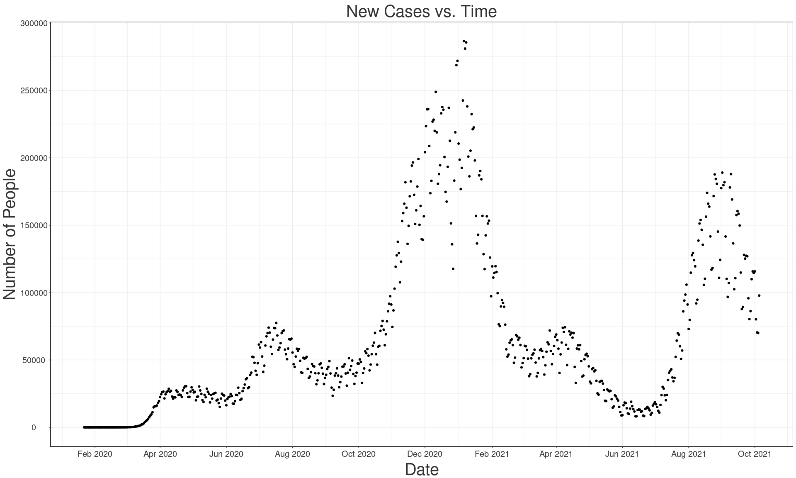
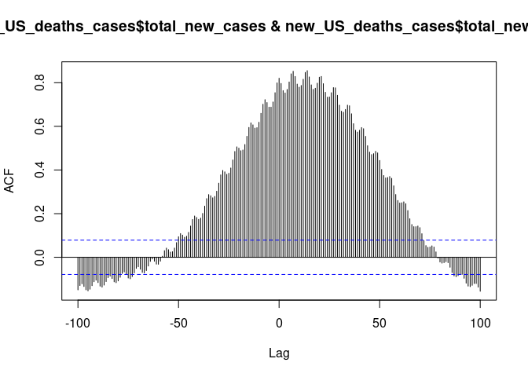

Scratchwork
================

``` r
library(tidyverse)
library(broom)
```

``` r
US_deaths_cases <- 
  read_csv("/cloud/project/data/United_States_COVID-19_Cases_and_Deaths_by_State_over_Time.csv")
```

    ## Rows: 37380 Columns: 15

    ## ── Column specification ────────────────────────────────────────────────────────
    ## Delimiter: ","
    ## chr  (5): submission_date, state, created_at, consent_cases, consent_deaths
    ## dbl (10): tot_cases, conf_cases, prob_cases, new_case, pnew_case, tot_death,...

    ## 
    ## ℹ Use `spec()` to retrieve the full column specification for this data.
    ## ℹ Specify the column types or set `show_col_types = FALSE` to quiet this message.

``` r
glimpse(US_deaths_cases)
```

    ## Rows: 37,380
    ## Columns: 15
    ## $ submission_date <chr> "02/12/2021", "03/01/2021", "08/22/2020", "08/12/2020"…
    ## $ state           <chr> "UT", "CO", "AR", "AS", "AS", "MA", "GA", "NYC", "AS",…
    ## $ tot_cases       <dbl> 359641, 438745, 56199, 0, 0, 704796, 1187107, 948436, …
    ## $ conf_cases      <dbl> 359641, 411869, NA, NA, NA, 659246, 937515, 782257, NA…
    ## $ prob_cases      <dbl> 0, 26876, NA, NA, NA, 45550, 249592, 166179, NA, NA, 4…
    ## $ new_case        <dbl> 1060, 677, 547, 0, 0, 451, 3829, 394, 0, 8835, 2766, 3…
    ## $ pnew_case       <dbl> 0, 60, 0, 0, NA, 46, 1144, 95, 0, 2003, 317, 29, 400, …
    ## $ tot_death       <dbl> 1785, 5952, 674, 0, 0, 17818, 21690, 33203, 0, 19190, …
    ## $ conf_death      <dbl> 1729, 5218, NA, NA, NA, 17458, 18725, 28130, NA, NA, 3…
    ## $ prob_death      <dbl> 56, 734, NA, NA, NA, 360, 2965, 5073, NA, NA, 0, 307, …
    ## $ new_death       <dbl> 11, 1, 11, 0, 0, 5, 7, 6, 0, 66, 3, 15, 10, 69, 0, 5, …
    ## $ pnew_death      <dbl> 2, 0, 0, 0, NA, 0, 0, 0, 0, 2, 0, 1, 2, 0, 0, 0, 0, 0,…
    ## $ created_at      <chr> "02/13/2021 02:50:08 PM", "03/01/2021 12:00:00 AM", "0…
    ## $ consent_cases   <chr> "Agree", "Agree", "Not agree", NA, NA, "Agree", "Agree…
    ## $ consent_deaths  <chr> "Agree", "Agree", "Not agree", NA, NA, "Agree", "Agree…

``` r
US_vaccinations <- 
  read_csv("/cloud/project/data/COVID-19_Vaccinations_in_the_United_States_Jurisdiction.csv")
```

    ## Rows: 19208 Columns: 81

    ## ── Column specification ────────────────────────────────────────────────────────
    ## Delimiter: ","
    ## chr  (2): Date, Location
    ## dbl (79): MMWR_week, Distributed, Distributed_Janssen, Distributed_Moderna, ...

    ## 
    ## ℹ Use `spec()` to retrieve the full column specification for this data.
    ## ℹ Specify the column types or set `show_col_types = FALSE` to quiet this message.

``` r
glimpse(US_vaccinations)
```

    ## Rows: 19,208
    ## Columns: 81
    ## $ Date                                   <chr> "10/05/2021", "10/05/2021", "10…
    ## $ MMWR_week                              <dbl> 40, 40, 40, 40, 40, 40, 40, 40,…
    ## $ Location                               <chr> "VA", "NV", "RP", "NE", "MI", "…
    ## $ Distributed                            <dbl> 12869745, 4045120, 33090, 25822…
    ## $ Distributed_Janssen                    <dbl> 573200, 199900, 3800, 116400, 6…
    ## $ Distributed_Moderna                    <dbl> 4833340, 1475340, 22900, 979980…
    ## $ Distributed_Pfizer                     <dbl> 7463205, 2369880, 6390, 1485870…
    ## $ Distributed_Unk_Manuf                  <dbl> 0, 0, 0, 0, 0, 0, 0, 0, 0, 0, 0…
    ## $ Dist_Per_100K                          <dbl> 150779, 131328, 184788, 133490,…
    ## $ Distributed_Per_100k_12Plus            <dbl> 176130, 154288, 216388, 159654,…
    ## $ Distributed_Per_100k_18Plus            <dbl> 192815, 169428, 237255, 177068,…
    ## $ Distributed_Per_100k_65Plus            <dbl> 947067, 815594, 1090640, 826431…
    ## $ Administered                           <dbl> 11024264, 3443155, 31240, 22012…
    ## $ Administered_12Plus                    <dbl> 10992921, 3443100, 31240, 22009…
    ## $ Administered_18Plus                    <dbl> 10178448, 3225317, 28652, 20476…
    ## $ Administered_65Plus                    <dbl> 2517946, 850914, 3551, 600142, …
    ## $ Administered_Janssen                   <dbl> 399119, 151785, 2333, 79234, 37…
    ## $ Administered_Moderna                   <dbl> 3963920, 1219801, 24444, 817158…
    ## $ Administered_Pfizer                    <dbl> 6655345, 2071438, 4463, 1300158…
    ## $ Administered_Unk_Manuf                 <dbl> 5880, 131, 0, 4746, 1616, 1270,…
    ## $ Administered_Fed_LTC                   <dbl> 217074, 74066, 0, 60654, 295799…
    ## $ Administered_Fed_LTC_Residents         <dbl> 109722, 16660, 0, 27041, 141181…
    ## $ Administered_Fed_LTC_Staff             <dbl> 80551, 14302, 0, 23762, 86738, …
    ## $ Administered_Fed_LTC_Unk               <dbl> 26801, 43104, 0, 9851, 67880, 1…
    ## $ Administered_Fed_LTC_Dose1             <dbl> 121472, 50270, 0, 37443, 182161…
    ## $ Administered_Fed_LTC_Dose1_Residents   <dbl> 58921, 9149, 0, 16713, 81899, 2…
    ## $ Administered_Fed_LTC_Dose1_Staff       <dbl> 44628, 7977, 0, 15423, 51531, 1…
    ## $ Administered_Fed_LTC_Dose1_Unk         <dbl> 17923, 33144, 0, 5307, 48731, 9…
    ## $ Admin_Per_100K                         <dbl> 129158, 111785, 174457, 113797,…
    ## $ Admin_Per_100k_12Plus                  <dbl> 150444, 131326, 204290, 136077,…
    ## $ Admin_Per_100k_18Plus                  <dbl> 152494, 135091, 205435, 140410,…
    ## $ Admin_Per_100k_65Plus                  <dbl> 185292, 171565, 117040, 192071,…
    ## $ Recip_Administered                     <dbl> 11015106, 3407219, 31501, 22079…
    ## $ Administered_Dose1_Recip               <dbl> 5877501, 1886012, 17827, 115491…
    ## $ Administered_Dose1_Pop_Pct             <dbl> 68.9, 61.2, 99.6, 59.7, 57.4, 6…
    ## $ Administered_Dose1_Recip_12Plus        <dbl> 5859164, 1885912, 17827, 115463…
    ## $ Administered_Dose1_Recip_12PlusPop_Pct <dbl> 80.2, 71.9, 99.9, 71.4, 66.7, 7…
    ## $ Administered_Dose1_Recip_18Plus        <dbl> 5430306, 1763229, 16486, 107349…
    ## $ Administered_Dose1_Recip_18PlusPop_Pct <dbl> 81.4, 73.9, 99.9, 73.6, 68.9, 7…
    ## $ Administered_Dose1_Recip_65Plus        <dbl> 1285517, 437932, 1785, 287680, …
    ## $ Administered_Dose1_Recip_65PlusPop_Pct <dbl> 94.6, 88.3, 58.8, 92.1, 89.0, 9…
    ## $ Series_Complete_Yes                    <dbl> 5209839, 1575904, 15556, 106388…
    ## $ Series_Complete_Pop_Pct                <dbl> 61.0, 51.2, 86.9, 55.0, 52.7, 5…
    ## $ Series_Complete_12Plus                 <dbl> 5197778, 1575865, 15556, 106379…
    ## $ Series_Complete_12PlusPop_Pct          <dbl> 71.1, 60.1, 99.9, 65.8, 61.2, 6…
    ## $ Series_Complete_18Plus                 <dbl> 4823813, 1484340, 14304, 992233…
    ## $ Series_Complete_18PlusPop_Pct          <dbl> 72.3, 62.2, 99.9, 68.0, 63.3, 6…
    ## $ Series_Complete_65Plus                 <dbl> 1167111, 385863, 1705, 275394, …
    ## $ Series_Complete_65PlusPop_Pct          <dbl> 85.9, 77.8, 56.2, 88.1, 84.1, 8…
    ## $ Series_Complete_Janssen                <dbl> 390589, 149312, 2338, 79114, 37…
    ## $ Series_Complete_Moderna                <dbl> 1826509, 552554, 11582, 385208,…
    ## $ Series_Complete_Pfizer                 <dbl> 2990444, 874003, 1636, 598304, …
    ## $ Series_Complete_Unk_Manuf              <dbl> 2297, 35, 0, 1260, 868, 446, 3,…
    ## $ Series_Complete_Janssen_12Plus         <dbl> 390495, 149308, 2338, 79096, 37…
    ## $ Series_Complete_Moderna_12Plus         <dbl> 1826340, 552550, 11582, 385188,…
    ## $ Series_Complete_Pfizer_12Plus          <dbl> 2978651, 873972, 1636, 598257, …
    ## $ Series_Complete_Unk_Manuf_12Plus       <dbl> 2292, 35, 0, 1258, 867, 446, 3,…
    ## $ Series_Complete_Janssen_18Plus         <dbl> 389060, 149270, 2338, 79040, 37…
    ## $ Series_Complete_Moderna_18Plus         <dbl> 1821019, 552455, 11582, 385060,…
    ## $ Series_Complete_Pfizer_18Plus          <dbl> 2611548, 782581, 384, 526920, 2…
    ## $ Series_Complete_Unk_Manuf_18Plus       <dbl> 2186, 34, 0, 1213, 810, 398, 3,…
    ## $ Series_Complete_Janssen_65Plus         <dbl> 67735, 23902, 227, 6449, 66933,…
    ## $ Series_Complete_Moderna_65Plus         <dbl> 549368, 180305, 1462, 134092, 7…
    ## $ Series_Complete_Pfizer_65Plus          <dbl> 549284, 181636, 16, 134058, 675…
    ## $ Series_Complete_Unk_Manuf_65Plus       <dbl> 724, 20, 0, 795, 509, 207, 3, 1…
    ## $ Series_Complete_FedLTC                 <dbl> 88584, 23917, 0, 23177, 113757,…
    ## $ Series_Complete_FedLTC_Residents       <dbl> 45746, 7416, 0, 10273, 58777, 2…
    ## $ Series_Complete_FedLTC_Staff           <dbl> 32916, 6273, 0, 8304, 34714, 11…
    ## $ Series_Complete_FedLTC_Unknown         <dbl> 9922, 10228, 0, 4600, 20266, 68…
    ## $ Additional_Doses                       <dbl> 0, 0, 0, 0, 0, 0, 0, 0, 0, 0, 0…
    ## $ Additional_Doses_Vax_Pct               <dbl> 0.0, 0.0, 0.0, 0.0, 0.0, 0.0, 0…
    ## $ Additional_Doses_18Plus                <dbl> 0, 0, 0, 0, 0, 0, 0, 0, 0, 0, 0…
    ## $ Additional_Doses_18Plus_Vax_Pct        <dbl> 0.0, 0.0, 0.0, 0.0, 0.0, 0.0, 0…
    ## $ Additional_Doses_50Plus                <dbl> 0, 0, 0, 0, 0, 0, 0, 0, 0, 0, 0…
    ## $ Additional_Doses_50Plus_Vax_Pct        <dbl> 0.0, 0.0, 0.0, 0.0, 0.0, 0.0, 0…
    ## $ Additional_Doses_65Plus                <dbl> 0, 0, 0, 0, 0, 0, 0, 0, 0, 0, 0…
    ## $ Additional_Doses_65Plus_Vax_Pct        <dbl> 0.0, 0.0, 0.0, 0.0, 0.0, 0.0, 0…
    ## $ Additional_Doses_Moderna               <dbl> 0, 0, 0, 0, 0, 0, 0, 0, 0, 0, 0…
    ## $ Additional_Doses_Pfizer                <dbl> 0, 0, 0, 0, 0, 0, 0, 0, 0, 0, 0…
    ## $ Additional_Doses_Janssen               <dbl> 0, 0, 0, 0, 0, 0, 0, 0, 0, 0, 0…
    ## $ Additional_Doses_Unk_Manuf             <dbl> 0, 0, 0, 0, 0, 0, 0, 0, 0, 0, 0…

First we filter the data so it only includes the most up-to-date
vaccination numbers as of 10/05/2021:

``` r
October_vaccinations <- filter(US_vaccinations, Date == "10/05/2021")
```

Next, we take the top 20 locations and create a bar plot to see which
vaccines are in each respective location:

``` r
October_vaccinations %>% 
  select(Location, Series_Complete_Yes, Series_Complete_Janssen,
         Series_Complete_Moderna, Series_Complete_Pfizer, 
         Series_Complete_Unk_Manuf) %>%
  filter(Location != "US") %>%
  group_by(Location) %>%
  arrange(desc(Series_Complete_Yes)) %>%
  head(20) %>%
  pivot_longer(cols = -Location, names_to = "Series_Type") %>%
  filter(Series_Type == "Series_Complete_Janssen" | 
           Series_Type == "Series_Complete_Moderna" |
           Series_Type == "Series_Complete_Pfizer" | 
           Series_Type == "Series_Complete_Unk_Manuf") %>%
  ggplot(aes(x = reorder(Location, value), 
             y = value/ 10^6, 
             fill = Series_Type)) +
  geom_bar(stat = "identity") + 
  labs(title = "US Vaccinations Breakdown",
       x = "Location",
       y = "People (in millions)",
       fill = "Type of Vaccine") +
  coord_flip() + 
  theme_bw() +
  scale_color_viridis_d() +
  scale_y_continuous(breaks = scales::pretty_breaks(n = 20))
```

<!-- -->

It looks like the Pfizer vaccine is the most popular across the board.
If we want a better visualization to compare states, we could filter out
the `US` location from this chart.

``` r
October_vaccinations %>% 
  select(Location, Series_Complete_Yes, Series_Complete_Janssen,
         Series_Complete_Moderna, Series_Complete_Pfizer, 
         Series_Complete_Unk_Manuf) %>%
  filter(!(Location %in% c("VI", "VA2", "DD2", 
                       "PR", "IH2", "BP2", 
                       "GU", "FM", "MP", 
                       "AS", "MH", "RP", 
                       "LTC"))) %>%
  group_by(Location) %>%
  arrange(desc(Series_Complete_Yes)) %>%
  pivot_longer(cols = -Location, names_to = "Series_Type") %>%
  filter(Series_Type == "Series_Complete_Janssen" | 
           Series_Type == "Series_Complete_Moderna" |
           Series_Type == "Series_Complete_Pfizer" | 
           Series_Type == "Series_Complete_Unk_Manuf") %>%
  ggplot(aes(x = reorder(Location, value), 
             y = value/ 10^6, 
             fill = Series_Type)) +
  geom_bar(stat = "identity", position = "fill") + 
  labs(title = "US Vaccinations Breakdown",
       x = "Location",
       y = "Fraction of Population",
       fill = "Type of Vaccine") +
  coord_flip() + 
  theme_bw() +
  scale_color_viridis_d() +
  scale_y_continuous(breaks = scales::pretty_breaks(n = 10)) 
```

<!-- -->

Vaccination breakdown for all 50 states and DC.

``` r
new_US_deaths_cases <- US_deaths_cases %>%
  filter(!(state %in% c("NYC", "PR", "GU",
                           "VI", "MP", "RMI",
                           "AS", "PW", "FSM"))) %>%
  group_by(submission_date) %>%
  summarise(total_new_cases = sum(new_case),
            total_new_deaths = sum(new_death)) 

new_US_deaths_cases$submission_date = as.Date(new_US_deaths_cases$submission_date,
                                              format="%m/%d/%Y")

new_US_deaths_cases
```

    ## # A tibble: 623 × 3
    ##    submission_date total_new_cases total_new_deaths
    ##    <date>                    <dbl>            <dbl>
    ##  1 2021-01-01               210546             3128
    ##  2 2021-01-02               198578             2596
    ##  3 2021-01-03               176774             2510
    ##  4 2021-01-04               192485             2846
    ##  5 2021-01-05               242515             3707
    ##  6 2021-01-06               286542             4040
    ##  7 2021-01-07               281017             3948
    ##  8 2021-01-08               285602             3882
    ##  9 2021-01-09               238120             3347
    ## 10 2021-01-10               200888             2734
    ## # … with 613 more rows

``` r
new_US_deaths_cases %>%
  ggplot() +
  geom_point(aes(x = submission_date, y = total_new_cases)) +
  labs(title = "New Cases vs. Time",
       x = "Date",
       y = "Number of People") +
  theme_bw() +
  theme(axis.line = element_line(colour = "black"),
        axis.text.x = element_text(color = "grey20", 
                                   size = 15, 
                                   angle = 0, 
                                   hjust = .5, 
                                   vjust = .5, 
                                   face = "plain"),
        axis.text.y = element_text(color = "grey20", 
                                   size = 15, 
                                   angle = 0, 
                                   hjust = .5, 
                                   vjust = .5, 
                                   face = "plain"),  
        axis.title.x = element_text(color = "grey20", 
                                    size = 30, 
                                    angle = 0, 
                                    hjust = .5, 
                                    vjust = 0, 
                                    face = "plain"),
        axis.title.y = element_text(color = "grey20", 
                                    size = 30, 
                                    angle = 90, 
                                    hjust = .5, 
                                    vjust = 1, 
                                    face = "plain"),
        plot.title = element_text(color = "grey20", 
                                    size = 30, 
                                    angle = 0, 
                                    hjust = .5, 
                                    vjust = .5, 
                                    face = "plain")) +
  scale_x_date(date_breaks = "2 month", date_labels =  "%b %Y") +
  scale_y_continuous(breaks = scales::pretty_breaks(n = 10))
```

<!-- -->

``` r
new_US_deaths_cases %>%
  ggplot() +
  geom_point(aes(x = submission_date, y = total_new_deaths)) +
  labs(title = "New Deaths vs. Time",
       x = "Date",
       y = "Number of People") +
  theme_bw() +
  theme(axis.line = element_line(colour = "black"),
        axis.text.x = element_text(color = "grey20", 
                                   size = 15, 
                                   angle = 0, 
                                   hjust = .5, 
                                   vjust = .5, 
                                   face = "plain"),
        axis.text.y = element_text(color = "grey20", 
                                   size = 15, 
                                   angle = 0, 
                                   hjust = .5, 
                                   vjust = .5, 
                                   face = "plain"),  
        axis.title.x = element_text(color = "grey20", 
                                    size = 30, 
                                    angle = 0, 
                                    hjust = .5, 
                                    vjust = 0, 
                                    face = "plain"),
        axis.title.y = element_text(color = "grey20", 
                                    size = 30, 
                                    angle = 90, 
                                    hjust = .5, 
                                    vjust = 1, 
                                    face = "plain"),
        plot.title = element_text(color = "grey20", 
                                    size = 30, 
                                    angle = 0, 
                                    hjust = .5, 
                                    vjust = .5, 
                                    face = "plain")) +
  scale_x_date(date_breaks = "2 month", date_labels =  "%b %Y") +
  scale_y_continuous(breaks = scales::pretty_breaks(n = 10))
```

<!-- -->

``` r
new_US_vaccinations <- US_vaccinations %>%
  select(Date, Location, Series_Complete_Yes, 
         Series_Complete_Pop_Pct,
         Series_Complete_12PlusPop_Pct,
         Series_Complete_18PlusPop_Pct,
         Series_Complete_65PlusPop_Pct,
         Series_Complete_Janssen, Series_Complete_Moderna, 
         Series_Complete_Pfizer, Series_Complete_Unk_Manuf) %>%
  filter(Location %in% c("US"))

new_US_vaccinations$Date = as.Date(new_US_vaccinations$Date,
                                              format="%m/%d/%Y")

new_US_vaccinations
```

    ## # A tibble: 297 × 11
    ##    Date       Location Series_Complete_Yes Series_Complete_P… Series_Complete_1…
    ##    <date>     <chr>                  <dbl>              <dbl>              <dbl>
    ##  1 2021-10-05 US                 186060146               56                 65.6
    ##  2 2021-10-04 US                 185788098               56                 65.5
    ##  3 2021-10-03 US                 185492579               55.9               65.4
    ##  4 2021-10-02 US                 185143698               55.8               65.2
    ##  5 2021-10-01 US                 184852416               55.7               65.1
    ##  6 2021-09-30 US                 184601450               55.6               65.1
    ##  7 2021-09-29 US                 184335263               55.5               65  
    ##  8 2021-09-28 US                 184065824               55.5               64.9
    ##  9 2021-09-27 US                 183888907               55.4               64.8
    ## 10 2021-09-26 US                 183670870               55.3               64.7
    ## # … with 287 more rows, and 6 more variables:
    ## #   Series_Complete_18PlusPop_Pct <dbl>, Series_Complete_65PlusPop_Pct <dbl>,
    ## #   Series_Complete_Janssen <dbl>, Series_Complete_Moderna <dbl>,
    ## #   Series_Complete_Pfizer <dbl>, Series_Complete_Unk_Manuf <dbl>

``` r
new_US_vaccinations %>%
  filter(Series_Complete_Pop_Pct > 0) %>%
  ggplot() +
  geom_point(aes(x = Date, y = Series_Complete_Pop_Pct)) +
  labs(title = "Series Complete Vaccinations Pop. Pct vs. Time",
       x = "Date",
       y = "Percent of US Population") +
  theme_bw() +
  theme(axis.line = element_line(colour = "black"),
        axis.text.x = element_text(color = "grey20", 
                                   size = 15, 
                                   angle = 0, 
                                   hjust = .5, 
                                   vjust = .5, 
                                   face = "plain"),
        axis.text.y = element_text(color = "grey20", 
                                   size = 15, 
                                   angle = 0, 
                                   hjust = .5, 
                                   vjust = .5, 
                                   face = "plain"),  
        axis.title.x = element_text(color = "grey20", 
                                    size = 30, 
                                    angle = 0, 
                                    hjust = .5, 
                                    vjust = 0, 
                                    face = "plain"),
        axis.title.y = element_text(color = "grey20", 
                                    size = 30, 
                                    angle = 90, 
                                    hjust = .5, 
                                    vjust = 1, 
                                    face = "plain"),
        plot.title = element_text(color = "grey20", 
                                    size = 30, 
                                    angle = 0, 
                                    hjust = .5, 
                                    vjust = .5, 
                                    face = "plain")) +
  scale_x_date(date_breaks = "1 month", date_labels =  "%b %Y") +
  scale_y_continuous(breaks = scales::pretty_breaks(n = 10))
```

<!-- -->

``` r
new_US_vaccinations %>%
  filter(Series_Complete_Yes > 0) %>%
  ggplot() +
  geom_point(aes(x = Date, y = Series_Complete_Yes / 10^6)) +
  labs(title = "Series Complete Vaccinations Total Pop. vs. Time",
       x = "Date",
       y = "Number of people (in millions)") +
  theme_bw() +
  theme(axis.line = element_line(colour = "black"),
        axis.text.x = element_text(color = "grey20", 
                                   size = 15, 
                                   angle = 0, 
                                   hjust = .5, 
                                   vjust = .5, 
                                   face = "plain"),
        axis.text.y = element_text(color = "grey20", 
                                   size = 15, 
                                   angle = 0, 
                                   hjust = .5, 
                                   vjust = .5, 
                                   face = "plain"),  
        axis.title.x = element_text(color = "grey20", 
                                    size = 30, 
                                    angle = 0, 
                                    hjust = .5, 
                                    vjust = 0, 
                                    face = "plain"),
        axis.title.y = element_text(color = "grey20", 
                                    size = 30, 
                                    angle = 90, 
                                    hjust = .5, 
                                    vjust = 1, 
                                    face = "plain"),
        plot.title = element_text(color = "grey20", 
                                    size = 30, 
                                    angle = 0, 
                                    hjust = .5, 
                                    vjust = .5, 
                                    face = "plain")) +
  scale_x_date(date_breaks = "1 month", date_labels =  "%b %Y") +
  scale_y_continuous(breaks = scales::pretty_breaks(n = 10))
```

<!-- -->

``` r
Pop_Pct.labs <- c("% Fully Vaccinated 12+", 
                  "% Fully Vaccinated (Total Pop)",
                  "% Fully Vaccinated 18+", 
                  "% Fully Vaccinated 65+")
names(Pop_Pct.labs) <- c("Series_Complete_12PlusPop_Pct", 
                         "Series_Complete_Pop_Pct",
                         "Series_Complete_18PlusPop_Pct",
                         "Series_Complete_65PlusPop_Pct")

new_US_vaccinations %>%
  filter(Series_Complete_Yes > 0) %>%
  pivot_longer(cols = c(Series_Complete_Pop_Pct,
                        Series_Complete_12PlusPop_Pct,
                        Series_Complete_18PlusPop_Pct,
                        Series_Complete_65PlusPop_Pct),
               names_to = "Pop_Pct_Type",
               values_to = "Pop_Pct") %>%
  ggplot() +
  geom_point(aes(x = Date, y = Pop_Pct)) +
  facet_wrap(~Pop_Pct_Type,
             labeller = labeller(Pop_Pct_Type = Pop_Pct.labs)) + 
  labs(title = "Fully Vaccinated Pop. Pct vs. Time",
       x = "Date",
       y = "Percent of US Population") +
  theme_bw() +
  theme(strip.text = element_text(size = 20),
        axis.line = element_line(colour = "black"),
        axis.text.x = element_text(color = "grey20", 
                                   size = 15, 
                                   angle = 0, 
                                   hjust = .5, 
                                   vjust = .5, 
                                   face = "plain"),
        axis.text.y = element_text(color = "grey20", 
                                   size = 15, 
                                   angle = 0, 
                                   hjust = .5, 
                                   vjust = .5, 
                                   face = "plain"),  
        axis.title.x = element_text(color = "grey20", 
                                    size = 30, 
                                    angle = 0, 
                                    hjust = .5, 
                                    vjust = 0, 
                                    face = "plain"),
        axis.title.y = element_text(color = "grey20", 
                                    size = 30, 
                                    angle = 90, 
                                    hjust = .5, 
                                    vjust = 1, 
                                    face = "plain"),
        plot.title = element_text(color = "grey20", 
                                    size = 30, 
                                    angle = 0, 
                                    hjust = .5, 
                                    vjust = .5, 
                                    face = "plain")) +
  scale_x_date(date_breaks = "2 month", date_labels =  "%b %Y") +
  scale_y_continuous(breaks = scales::pretty_breaks(n = 10))
```

<!-- -->
